# *Next.js 时间线阶段计划*

## *1. 计划目标*

*这份* `plan.md` *的目标不是重复* `nextjs-full-chain-plan.md` *的全部内容，而是把那份全量设计文档重新压缩成一条**严格按先后发生顺序展开的时间线**。*

*核心问题只有一个：*

`从编辑器里的 Next.js 源码开始，到浏览器里页面变成可交互状态，中间到底先发生了什么，后发生了什么。`

*因此这份计划会把整套讲解拆成多个* `stage`*，每个* `stage` *都满足三点：*

- *有明确的时间位置*
- *有明确的输入与输出*
- *有明确的“这一阶段为什么存在”*

## *2. 时间线总原则*

*整条链路按“发生顺序”拆解，而不是按技术名词分类拆解。*

*也就是说，顺序不是：*

- *先讲 React*
- *再讲 SSR*
- *再讲 CDN*
- *再讲浏览器*

*而是：*

1. *开发者在编辑器里写代码*
2. *本地项目被运行和验证*
3. *代码进入 Git 与 CI/CD*
4. *构建产物被发布到线上*
5. *浏览器请求线上资源*
6. *服务端与 CDN 返回首屏所需内容*
7. *浏览器解析并显示页面*
8. *React 接管并完成 hydration*
9. *页面进入可交互状态*
10. *用户点击后触发新的更新链路*

## *3. 总体阶段图*

```mermaid
flowchart LR
  Stage01["Stage 01
  编辑器源码建模"] --> Stage02["Stage 02
  本地项目启动"]
  Stage02 --> Stage03["Stage 03
  本地请求与开发验证"]
  Stage03 --> Stage04["Stage 04
  Git 提交与版本进入仓库"]
  Stage04 --> Stage05["Stage 05
  CI 安装依赖与执行构建"]
  Stage05 --> Stage06["Stage 06
  产物拆分与发布部署"]
  Stage06 --> Stage07["Stage 07
  用户浏览器发起首个请求"]
  Stage07 --> Stage08["Stage 08
  CDN 与 Node SSR 协同返回资源"]
  Stage08 --> Stage09["Stage 09
  浏览器解析首屏内容"]
  Stage09 --> Stage10["Stage 10
  React hydration 接管页面"]
  Stage10 --> Stage11["Stage 11
  页面进入可交互状态"]
  Stage11 --> Stage12["Stage 12
  用户交互触发增量更新"]
```




## *4. 阶段拆分*

### *Stage 01. 编辑器源码建模*

#### *时间位置*

*整条链路的起点。*

#### *发生地点*

*开发者机器上的编辑器与项目目录。*

#### *主要参与者*

- *开发者*
- `Next.js App Router`
- `TypeScript`
- `React Server Component`
- `React Client Component`

#### *输入*

- *产品意图*
- *页面结构*
- *状态设计*
- *路由设计*
- *本地 mock 数据设计*

#### *输出*

- *主链路代码目录* `full-chain/`
- *独立场景目录* `scenarios/`*
- *语义化命名后的文件、组件、函数、变量、路由*

#### *这一阶段要讲什么*

- *源码本质上不是页面，而是“状态、结构、交互规则”*
- `Server Component` *和* `Client Component` *的边界如何在代码中体现*
- *为什么目录结构本身也是系统设计的一部分*

#### *交付物*

- *主项目目录骨架*
- *独立场景目录骨架*
- *第一批最小可执行源码*

---

### *Stage 02. 本地项目启动*

#### *时间位置*

*源码写完之后，进入第一次可运行阶段。*

#### *发生地点*

*开发者机器上的终端与本地 Node.js 环境。*

#### *主要参与者*

- `pnpm`
- `next dev`
- *本地文件系统*
- *Next.js 开发服务器*

#### *输入*

- `package.json`
- `pnpm-lock.yaml`
- `app/`*、*`components/`*、*`lib/`

#### *输出*

- *本地开发服务*
- *可被浏览器访问的开发地址*
- *开发态下的模块图与运行时环境*

#### *这一阶段要讲什么*

- `pnpm install` *和* `pnpm dev` *实际建立了什么运行基础*
- *Next.js 开发服务器启动时做了哪些准备*
- *为什么此时代码还不是“线上产物”，而是“开发态可执行环境”*

#### *交付物*

- `full-chain/README.md` *中的本地运行说明*
- *每个场景目录中的单独运行命令*

---

### *Stage 03. 本地请求与开发验证*

#### *时间位置*

*本地开发服务器启动之后，浏览器第一次访问本地页面时。*

#### *发生地点*

- *开发者本地浏览器*
- *本地 Next.js 开发服务器*

#### *主要参与者*

- *浏览器*
- *本地 Node 服务*
- *本地* `Route Handler`
- *本地 mock 数据*

#### *输入*

- *浏览器访问本地 URL*
- *开发服务器读取页面源码*

#### *输出*

- *本地首屏 HTML*
- *开发态下的脚本与样式资源*
- *可观察的页面结果*

#### *这一阶段要讲什么*

- *本地访问页面时，Next.js 如何在开发态组织响应*
- *为什么主链路可以在本地形成闭环*
- *为什么独立场景要优先避免外部依赖*

#### *交付物*

- *主链路本地运行截图或阶段图*
- *各场景本地访问入口说明*

---

### *Stage 04. Git 提交与版本进入仓库*

#### *时间位置*

*本地验证通过之后，代码被纳入版本控制。*

#### *发生地点*

- *开发者本地 Git 仓库*
- *GitHub 远程仓库*

#### *主要参与者*

- `git add`
- `git commit`
- `git push`
- *GitHub 仓库*

#### *输入*

- *已通过本地验证的源码*

#### *输出*

- *可追踪版本*
- *触发 CI/CD 的代码快照*

#### *这一阶段要讲什么*

- *为什么“编辑器里的代码”不会直接变成线上页面*
- *Git 在整个链路里扮演的是“版本冻结点”*
- *CI/CD 为什么必须以仓库中的提交为起点*

#### *交付物*

- *最小 Git 提交建议*
- *文档中的版本进入线上前置说明*

---

### *Stage 05. CI 安装依赖与执行构建*

#### *时间位置*

*代码推送到远程仓库之后。*

#### *发生地点*

- *CI 运行环境*

#### *主要参与者*

- `GitHub Actions`
- `pnpm install`
- `pnpm build`
- *Next.js 构建系统*

#### *输入*

- *GitHub 仓库中的源码快照*
- *CI 配置文件*

#### *输出*

- *通过校验的构建结果*
- *服务端产物*
- *客户端产物*
- *静态资源*

#### *这一阶段要讲什么*

- *CI 如何复现项目环境*
- *Next.js build 如何把源码拆成不同职责的产物*
- `SSR / SSG / RSC / CSR` *在构建阶段分别留下什么痕迹*

#### *交付物*

- `GitHub Actions` *最小工作流*
- *build 阶段说明图*

---

### *Stage 06. 产物拆分与发布部署*

#### *时间位置*

*CI 构建成功之后。*

#### *发生地点*

- *构建产物存储位置*
- *CDN*
- *Node SSR 服务部署环境*

#### *主要参与者*

- *静态资源发布系统*
- *CDN*
- *Node SSR 服务*

#### *输入*

- *build 产物*

#### *输出*

- *发布到 CDN 的静态资源*
- *部署到 Node 环境的 SSR 服务代码*
- *用户可访问的线上域名*

#### *这一阶段要讲什么*

- *哪些资源适合放在 CDN*
- *哪些逻辑必须留在 Node SSR 服务*
- *为什么“同一个 Next.js 项目”最终会以多种产物形态上线*

#### *交付物*

- *部署拓扑图*
- *静态产物与服务端产物职责表*

---

### *Stage 07. 用户浏览器发起首个请求*

#### *时间位置*

*部署完成之后，用户第一次访问线上页面时。*

#### *发生地点*

- *用户浏览器*
- *线上域名入口*

#### *主要参与者*

- *浏览器地址栏*
- *DNS*
- *CDN*
- *Node SSR 服务*

#### *输入*

- *用户输入 URL 或点击页面链接*

#### *输出*

- *发送到线上系统的第一个 HTTP 请求*

#### *这一阶段要讲什么*

- *浏览器如何从 URL 开始进入网络链路*
- *为什么首个请求不是“拿到页面”，而是“请求字节”*
- *网络与部署视角下，用户真正接入的是哪一层入口*

#### *交付物*

- *首次请求时序图*
- *线上入口示意图*

---

### *Stage 08. CDN 与 Node SSR 协同返回资源*

#### *时间位置*

*首个请求到达线上系统之后。*

#### *发生地点*

- *CDN 边缘节点*
- *Node SSR 服务*

#### *主要参与者*

- *HTML 响应*
- *JS bundle*
- *CSS 资源*
- *RSC payload*
- *Route Handler*

#### *输入*

- *浏览器的页面请求*

#### *输出*

- *首屏 HTML*
- *首屏样式资源*
- *客户端脚本资源*
- *与页面对应的服务端数据结果*

#### *这一阶段要讲什么*

- *首屏到底是谁生成的*
- `SSG` *页面与* `SSR` *页面在线上返回路径上有什么差异*
- `RSC` *的服务端结果如何参与首屏输出*

#### *交付物*

- *线上响应阶段图*
- *主链路响应说明*

---

### *Stage 09. 浏览器解析首屏内容*

#### *时间位置*

*浏览器收到首屏响应之后，但 React 尚未完成接管之前。*

#### *发生地点*

- *浏览器渲染引擎*

#### *主要参与者*

- *HTML parser*
- *CSS parser*
- *DOM*
- *CSSOM*
- *Render Tree*

#### *输入*

- *HTML 字节*
- *CSS 字节*

#### *输出*

- *首屏可见内容*
- *首屏布局结果*

#### *这一阶段要讲什么*

- *为什么页面可以“先显示”*
- `DOM / CSSOM / Layout / Paint / Composite` *的先后关系*
- *这一阶段用户“能看到但未必能交互”的原因*

#### *交付物*

- *浏览器渲染管线图*
- *最小样式与布局代码样例*

---

### *Stage 10. React hydration 接管页面*

#### *时间位置*

*首屏可见之后，客户端脚本下载并执行时。*

#### *发生地点*

- *浏览器 JavaScript 运行环境*

#### *主要参与者*

- *客户端 bundle*
- *React runtime*
- *Hydration 逻辑*
- *Client Component*

#### *输入*

- *已经显示出来的 HTML*
- *浏览器下载到的客户端 JS*

#### *输出*

- *被 React 接管的页面节点*
- *已经绑定事件的客户端组件*

#### *这一阶段要讲什么*

- *为什么页面是“先能看，后能点”*
- *Hydration 在 React/Next.js 中到底做了什么*
- *为什么不是所有源码都会进入浏览器*

#### *交付物*

- *hydration 场景代码*
- *hydration 阶段图*

---

### *Stage 11. 页面进入可交互状态*

#### *时间位置*

*Hydration 完成之后。*

#### *发生地点*

- *浏览器*

#### *主要参与者*

- *用户输入事件*
- *React 事件系统*
- *客户端状态*

#### *输入*

- *已完成 hydration 的页面*

#### *输出*

- *可点击、可输入、可触发客户端更新的页面*

#### *这一阶段要讲什么*

- *什么叫“页面可交互”*
- *从系统视角看，可交互意味着哪些前置条件已经满足*
- *为什么“看见页面”不等于“页面已经 ready”*

#### *交付物*

- *主链路“ready”判定说明*
- *浏览器可交互状态定义*

---

### *Stage 12. 用户交互触发增量更新*

#### *时间位置*

*页面已经可交互之后，用户发生点击、输入、请求等行为时。*

#### *发生地点*

- *浏览器*
- *必要时回到 Node 服务*

#### *主要参与者*

- `setState`
- *React 更新调度*
- *DOM patch*
- *浏览器重排、重绘、合成*
- `fetch`
- `Route Handler`

#### *输入*

- *用户点击按钮*
- *用户触发请求*

#### *输出*

- *局部 UI 更新*
- *新的网络请求与响应*
- *页面局部重绘后的结果*

#### *这一阶段要讲什么*

- *一次点击后 React 内部先发生什么*
- *什么时候只在浏览器内更新，什么时候需要再请求服务端*
- *为什么 UI 更新最终仍然要落回浏览器渲染管线*

#### *交付物*

- `stage5-csr-basic/` *场景*
- `stage6-api-roundtrip/` *场景*
- *点击更新时序图*

## *5. 阶段归组*

*为了后续写正文更顺滑，这 12 个阶段再归成 5 个大组。*

### *Group A. 源码形成阶段*

- `Stage 01`

### *Group B. 本地开发验证阶段*

- `Stage 02`
- `Stage 03`

### *Group C. 版本进入线上阶段*

- `Stage 04`
- `Stage 05`
- `Stage 06`

### *Group D. 浏览器首屏建立阶段*

- `Stage 07`
- `Stage 08`
- `Stage 09`
- `Stage 10`
- `Stage 11`

### *Group E. 交互更新阶段*

- `Stage 12`

## *6. 内容产出顺序*

*后续正式写文档时，不建议完全照章节号写，而建议按时间线组装。*

*推荐顺序如下：*

1. *先写* `Stage 01` *到* `Stage 03`
2. *再写* `Stage 04` *到* `Stage 06`
3. *再写* `Stage 07` *到* `Stage 11`
4. *最后写* `Stage 12`
5. *最后回头补全总图、阶段图、主链路与独立场景之间的交叉引用*

## *7. 每个 Stage 的统一模板*

*后续每个阶段都按同一模板展开，避免文风和颗粒度漂移。*

```md
## Stage XX. 阶段名

### 这一刻发生了什么

### 谁在参与

### 输入是什么

### 输出是什么

### 对应的真实代码

### 对应的图

### 这一阶段的本质

### 它和下一阶段怎么衔接
```

## *8. 当前结论*

*按时间线拆分后，整套内容的最核心顺序就是：*

`编辑器源码 -> 本地运行 -> Git 入库 -> CI 构建 -> 部署发布 -> 浏览器请求 -> 服务端/CDN 返回 -> 浏览器解析 -> React hydration -> 页面可交互 -> 用户交互更新`

*后续无论写主链路还是独立场景，都不应该打乱这个先后顺序。*