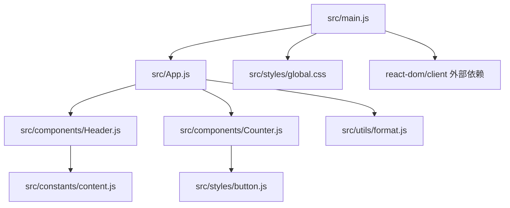
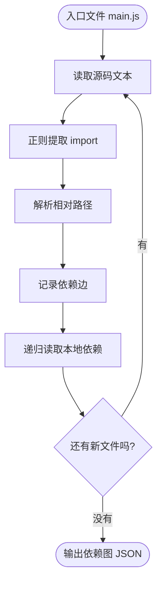
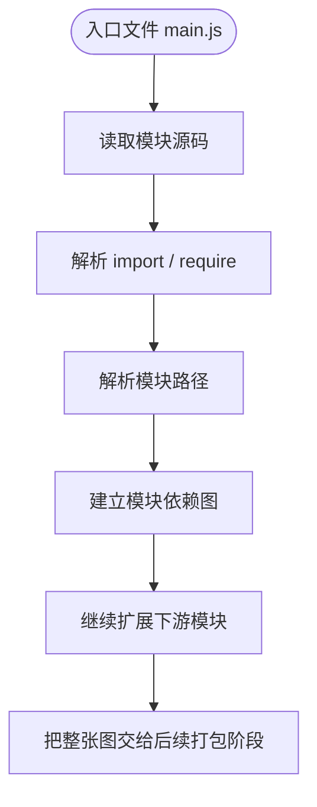
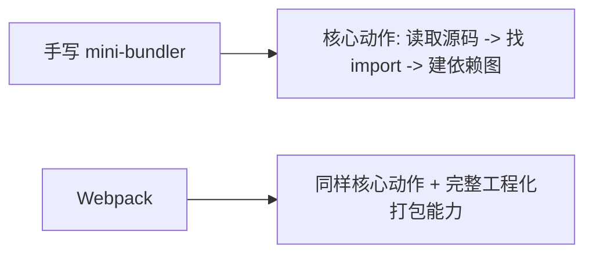

# 0-read-source-and-analyze-dependencies

> 目标：用**自己手写的简洁 JavaScript mini-bundler**，模拟“读取源码，分析依赖关系”，并和 **Webpack** 做对比。

## 目录结构

```text
0-read-source-and-analyze-dependencies/
├─ README.md
├─ package.json
├─ mini-bundler.js
├─ webpack.config.js
└─ demo-src/
   └─ src/
      ├─ main.js
      ├─ App.js
      ├─ components/
      ├─ utils/
      ├─ constants/
      └─ styles/
```

这里只有四类核心东西：

- `demo-src/`：给构建工具读取的示例源码
- `mini-bundler.js`：手写的最简依赖分析器
- `webpack.config.js`：Webpack 最小配置
- `package.json`：当前场景自己的依赖和命令

没有 TypeScript，没有额外页面层，没有多余目录。

---

## 1. 这一跳在全链路里的位置


这个场景只讲：

- 读取源码
- 找 import
- 解析路径
- 建依赖图

---

## 2. demo-src 的依赖图

下面这张图画的是 `demo-src/src/main.js` 作为入口时，手写 mini-bundler 读出来的依赖关系：



这张图里：

- 方块表示一个模块文件或一个外部依赖
- 箭头表示“左边这个模块 import 了右边这个模块”
- `react-dom/client` 不是项目里的相对路径文件，所以把它单独标成**外部依赖**

如果用一句话概括这张图：

> `main.js` 是入口，`App.js` 是第一层本地依赖，然后再继续展开到 `Header.js`、`Counter.js`、`format.js` 等下游模块。

---

## 3. 手写 mini-bundler 做了什么



一句话总结：

> 它把“从入口出发，沿着 import 一层层把项目摸出来”这件事，用最少的 JS 写出来。

---

## 4. Webpack 在这一跳做的是什么

Webpack 在“读取源码、分析依赖”这一步，核心动作并没有变：



区别不在于“有没有依赖分析”，而在于：

- mini-bundler 把这条主线裸露出来
- Webpack 把这条主线做成工程级系统

---

## 5. 怎么运行

先安装当前场景自己的依赖：

```bash
cd /Users/liu/Desktop/simulation-frontend/scenarios/0-read-source-and-analyze-dependencies
pnpm install
```

### 跑手写 mini-bundler

```bash
pnpm mini
```

### 跑 Webpack 打包

```bash
pnpm webpack:build
```

### 输出 Webpack stats 方便对照

```bash
pnpm webpack:stats
```

---

## 6. mini-bundler vs Webpack

### mini-bundler

**优点：**

- 最容易看懂核心机制
- 能直接看到“依赖图怎么长出来”
- 代码很短，适合教学

**缺点：**

- 不处理 alias
- 不处理 loader / plugin 生态
- 不处理缓存、增量更新、HMR
- 不处理复杂 node_modules / package exports 解析
- 不真正负责工程级 bundle 生成

### Webpack

**共同点：**

- 也要读取源码
- 也要识别 import / require
- 也要解析路径
- 也要建立模块关系图

**比 mini-bundler 多的：**

- loader 机制
- plugin 机制
- 更复杂的模块解析能力
- 更完整的资源接入能力
- 缓存、增量构建、工程级优化
- 真正的 bundle 输出能力

---

## 7. 一句对比结论



也就是说：

> mini-bundler 是为了把原理裸露出来；Webpack 是把同一原理做成可支撑真实项目的系统。

---

## 8. 最后的结论

这个场景不是为了造一个替代 Webpack 的工具，而是为了说明：

> **在“编译、打包、输出”之前，构建工具必须先把源码之间的依赖关系建立出来。**

而这个场景里：

- `mini-bundler.js` 负责把核心原理讲透
- `webpack.config.js` 负责让你看到流行方案也是沿着同一主线工作
