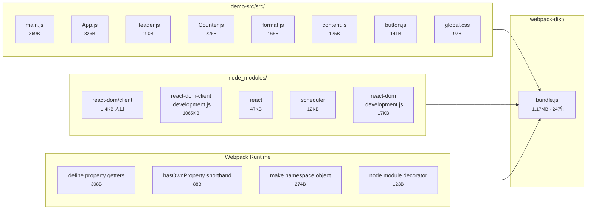
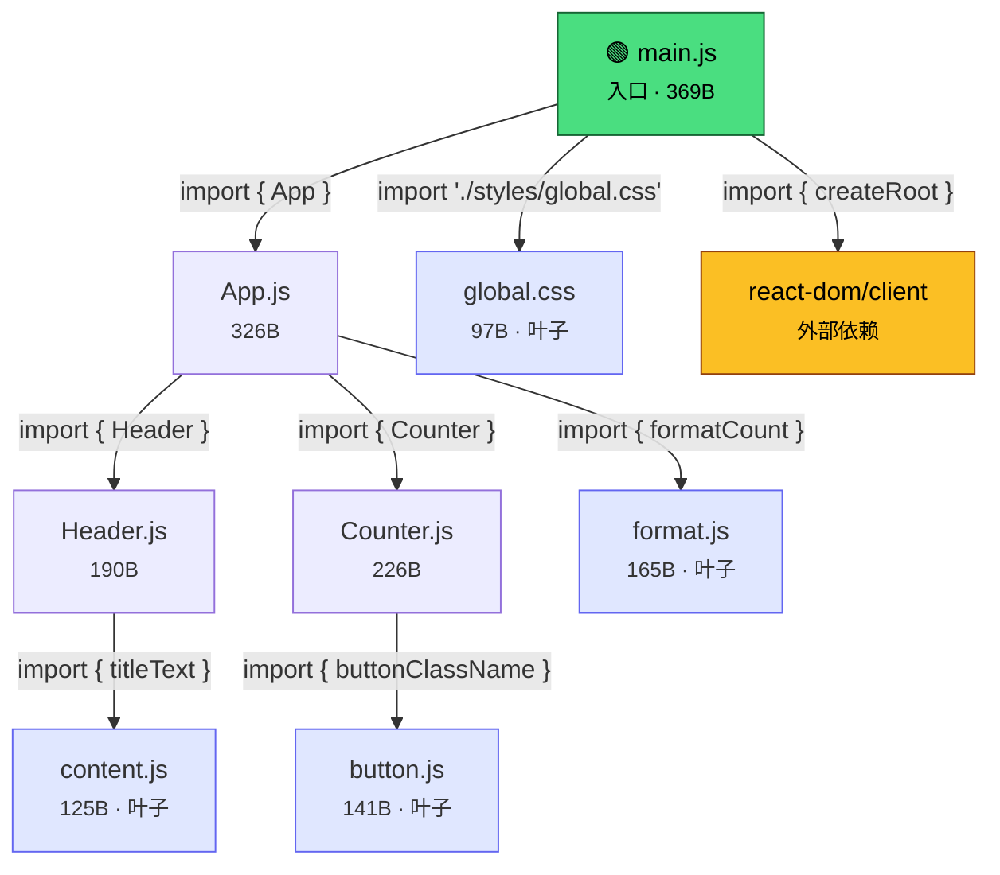
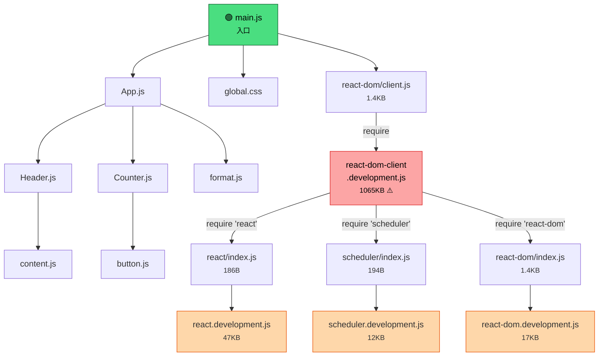
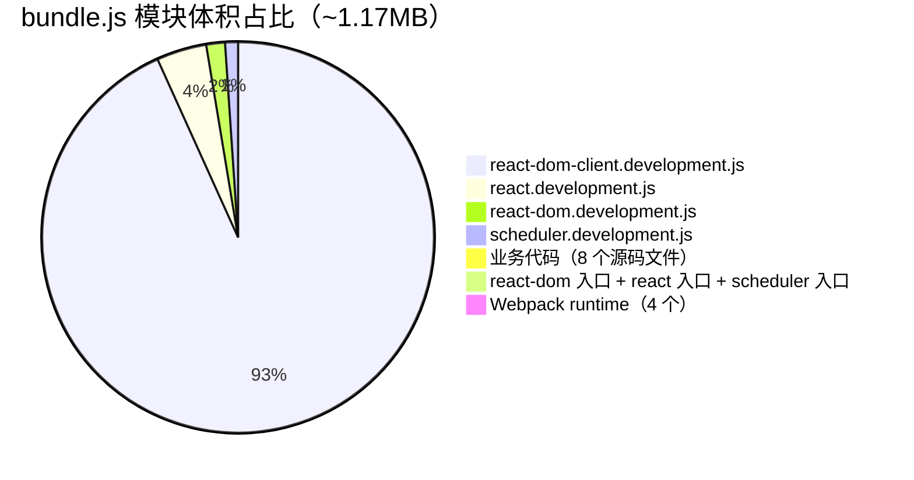
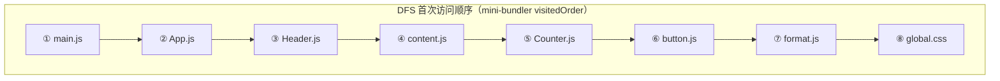
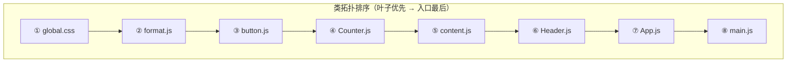
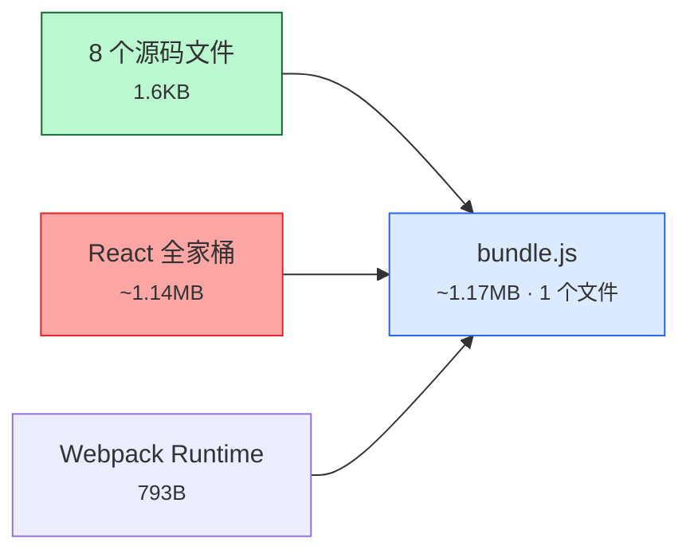

# 打包产物全景图

> 场景 0：读取源码与依赖分析 — 从源码到 bundle 的完整映射

---

## 1. 源码 → 依赖图 → 产物 总览

---

## 2. 依赖图：源码模块间的 import 关系

---

## 3. Webpack 完整模块图（含 node_modules 展开）

---

## 4. 模块体积占比

> 业务代码仅占 **0.14%**，React 运行时占 **99.5%**。这是 `mode: 'development'` 下的典型分布。

---

## 5. bundle.js 内部结构

```mermaid
flowchart TB
  subgraph BUNDLE ["webpack-dist/bundle.js（247 行 · ~1.17MB）"]
    direction TB

    IIFE["(() => { // webpackBootstrap"]

    subgraph MODULES ["__webpack_modules__ 对象"]
      direction TB
      W_MAIN["'./demo-src/src/main.js'<br/>→ eval(源码)"]
      W_APP["'./demo-src/src/App.js'<br/>→ eval(源码)"]
      W_HEADER["'./demo-src/src/components/Header.js'<br/>→ eval(源码)"]
      W_COUNTER["'./demo-src/src/components/Counter.js'<br/>→ eval(源码)"]
      W_FORMAT["'./demo-src/src/utils/format.js'<br/>→ eval(源码)"]
      W_CONTENT["'./demo-src/src/constants/content.js'<br/>→ eval(源码)"]
      W_BUTTON["'./demo-src/src/styles/button.js'<br/>→ eval(源码)"]
      W_CSS["'./demo-src/src/styles/global.css'<br/>→ module.exports = CSS字符串"]
      W_RD["'react-dom/client.js'<br/>→ require 链"]
      W_ETC["... react / scheduler 等<br/>大体积模块"]
    end

    subgraph RUNTIME ["Webpack Runtime"]
      direction TB
      R_REQ["__webpack_require__<br/><small>模块加载函数</small>"]
      R_CACHE["__webpack_module_cache__<br/><small>模块缓存</small>"]
      R_DEFINE["__webpack_require__.d<br/><small>定义 getter</small>"]
      R_NS["__webpack_require__.r<br/><small>标记 ESM</small>"]
      R_HAS["__webpack_require__.o<br/><small>hasOwnProperty</small>"]
      R_DEC["module decorator<br/><small>兼容 CJS</small>"]
    end

    ENTRY_CALL["__webpack_require__('./demo-src/src/main.js')<br/><small>启动入口</small>"]

    IIFE --> MODULES
    IIFE --> RUNTIME
    RUNTIME --> ENTRY_CALL
  end
```

---

## 6. 源码文件到 bundle 模块的映射表

| 源码文件 | bundle 中的模块 key | 体积 | 引入方式 | 上游模块 |
|----------|---------------------|------|----------|----------|
| `src/main.js` | `./demo-src/src/main.js` | 369B | **entry** | — |
| `src/App.js` | `./demo-src/src/App.js` | 326B | ESM import | main.js |
| `src/components/Header.js` | `./demo-src/src/components/Header.js` | 190B | ESM import | App.js |
| `src/components/Counter.js` | `./demo-src/src/components/Counter.js` | 226B | ESM import | App.js |
| `src/utils/format.js` | `./demo-src/src/utils/format.js` | 165B | ESM import | App.js |
| `src/constants/content.js` | `./demo-src/src/constants/content.js` | 125B | ESM import | Header.js |
| `src/styles/button.js` | `./demo-src/src/styles/button.js` | 141B | ESM import | Counter.js |
| `src/styles/global.css` | `./demo-src/src/styles/global.css` | 97B | ESM import (side effect) | main.js |
| — | `react-dom/client.js` | 1.4KB | ESM import | main.js |
| — | `react-dom-client.development.js` | **1065KB** | CJS require | react-dom/client.js |
| — | `react/index.js` → `react.development.js` | 47KB | CJS require | react-dom-client |
| — | `scheduler/index.js` → `scheduler.development.js` | 12KB | CJS require | react-dom-client |
| — | `react-dom/index.js` → `react-dom.development.js` | 17KB | CJS require | react-dom-client |
| — | Webpack runtime × 4 | 793B | 内置注入 | — |

---

## 7. DFS 遍历顺序 vs 类拓扑排序

> 拓扑序保证：**被依赖的模块先处理，依赖者后处理。**
> Webpack 在执行时也遵循类似顺序：`__webpack_require__` 递归到叶子才开始返回值。

---

## 8. 一句话总结

> **所有源码 + 所有 npm 依赖 + Webpack 运行时 → 合并为一个 `bundle.js`。**
> 这就是"打包"最基本的含义：把依赖图上的所有节点，拼成浏览器可以直接加载的单文件。
