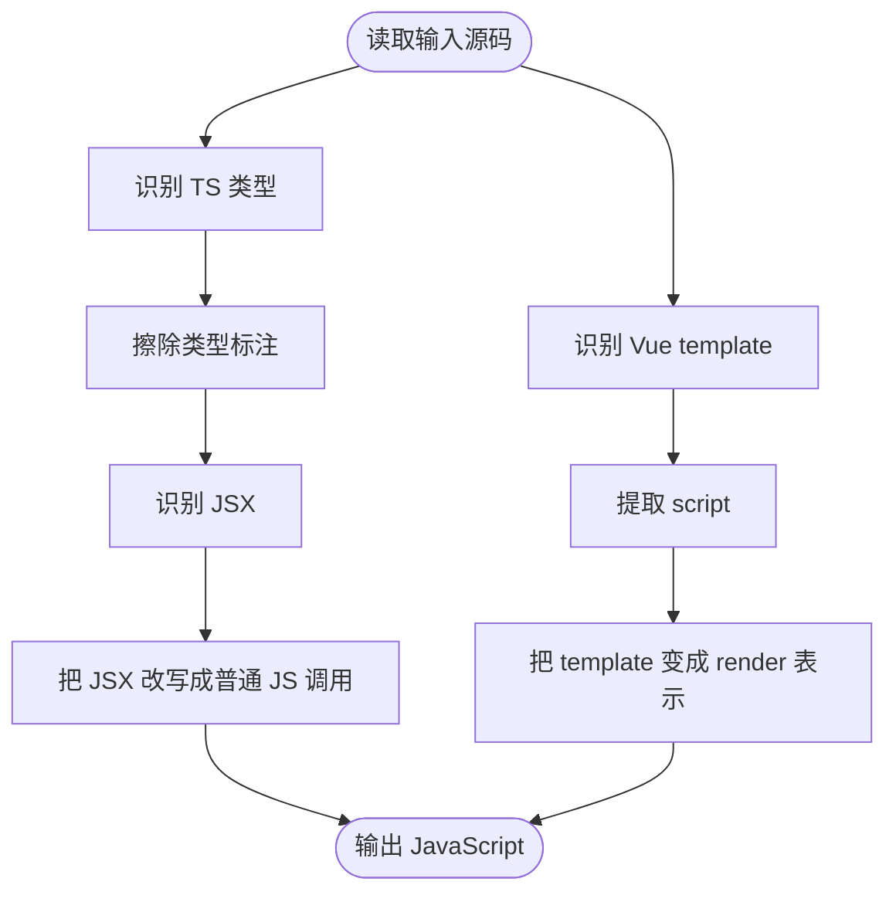

# 1-compile-framework-syntax-to-browser-javascript

> 目标：用**自己手写的简洁 JavaScript mini-compiler**，再补一个**真实 Babel 对照脚本**，一起模拟 **TypeScript / JSX / Vue 模板被编译成浏览器能执行的 JavaScript**。

## 目录结构

```text
1-compile-framework-syntax-to-browser-javascript/
├─ README.md
├─ package.json
├─ babel-compiler.js
├─ mini-compiler.js
└─ demo-input/
   ├─ input.tsx
   └─ input.vue
```

这里只有三类核心东西：

- `demo-input/`：给编译器处理的最小输入
- `mini-compiler.js`：手写的最小编译器
- `babel-compiler.js`：调用 Babel API 的真实对照脚本
- `package.json`：当前场景自己的命令

没有 TypeScript 工程壳子，没有额外框架层。

---

## 1. 这一跳在全链路里的位置


这个场景只讲：

- 把 TypeScript 类型擦掉
- 把 JSX 改写成普通 JS 表达
- 把 Vue template 变成 render 表示

---

## 2. 为什么需要这一跳

因为浏览器真正能执行的是 JavaScript，不是：

- TypeScript 类型标注
- JSX 语法
- Vue 单文件组件里的 template 块

所以构建工具在读完模块图之后，下一步就要做：

> **把更适合人写的框架语法，翻译成更适合浏览器执行的 JavaScript。**

---

## 3. mini-compiler 做了什么




一句话总结：

> 它把“源码里的高级语法”翻译成“浏览器更能执行的普通 JavaScript 表达”。

---

## 4. 输入和输出示意

### TypeScript + JSX

输入：

```tsx
type Props = {
  title: string;
};

export function App({ title }: Props) {
  const count: number = 1;
  return <h1>{title} {count}</h1>;
}
```

输出（教学级近似）：

```js
export function App({ title }) {
  const count = 1;
  return React.createElement('h1', null, title + ' ' + count);
}
```

### Vue template

输入：

```vue
<template>
  <section>
    <h1>{{ title }}</h1>
    <p>{{ subtitle }}</p>
  </section>
</template>
```

输出（教学级近似）：

```js
export function render() {
  return `<section> <h1>' + this.$data.title + '</h1> <p>' + this.$data.subtitle + '</p> </section>`;
}
```

重点不是精确复制 Vue 编译器，而是说明：

- template 不能原样给浏览器执行
- 它要先被转成 render 相关的 JS 表达

---

## 5. 手写版 vs 流行方案

### 手写 mini-compiler

**优点：**

- 代码短
- 容易看懂编译阶段到底在做什么
- 能直接看到“类型擦除 / JSX 改写 / template 转 render”的主线

**缺点：**

- 只支持极小输入范围
- 不做完整 AST 解析
- 不处理复杂语法边角
- 不能用于真实生产项目

### 流行方案（Babel / SWC / TypeScript / Vue Compiler）

**共同点：**

- 都在做“语法解析 -> 语法变换 -> JS 输出”

**比手写版多的：**

- 完整 AST 解析能力
- 更强的语法兼容性
- 插件系统
- 更复杂的 transform 规则
- 更好的 sourcemap / 性能 / 错误提示

### 这里补充的 Babel 对照脚本

为了让这个场景不只停留在“手写原理版”，这里额外补了一个 `babel-compiler.js`：

- 它读取 `demo-input/input.tsx`
- 用 `@babel/preset-typescript` 擦除类型
- 用 `@babel/preset-react` 把 JSX 改写成普通 JS 调用
- 输出一份结构化 JSON，方便和 `mini-compiler.js` 的结果对照着看

需要注意的是：

- 这个 Babel 对照脚本只覆盖 `TSX / JSX` 这一支
- `input.vue` 里的 `template` 仍然属于 Vue Compiler 的职责，不是 Babel 直接处理的对象

---

## 6. 怎么运行

```bash
cd /Users/liu/Desktop/simulation-frontend/scenarios/1-compile-framework-syntax-to-browser-javascript
pnpm mini
pnpm babel
```

你可以把两个命令对照着看：

- `pnpm mini`：看“手写教学版”如何一步步模拟编译阶段
- `pnpm babel`：看“真实 Babel”如何把 TSX 变成普通 JavaScript

---

## 7. 最后的结论

这个场景不是为了造一个替代 Babel / SWC / Vue Compiler 的工具，而是为了说明：

> **在依赖分析之后，构建系统还要把框架语法和类型语法翻译成浏览器更能执行的 JavaScript。**

而这个场景里：

- `mini-compiler.js` 负责把这个原理讲透
- `babel-compiler.js` 负责给出一个真实工具链里的 TSX 编译对照
- 流行方案负责把同一原理做成真正可支撑工程的编译系统

