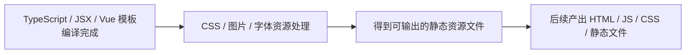

# 2-process-css-images-and-font-assets

> 目标：用一个**手写的最小 asset pipeline**，模拟 **CSS / 图片 / 字体等资源在构建阶段被整理、轻量转换、改名并输出到不同产物目录**。

## 目录结构

```text
2-process-css-images-and-font-assets/
├─ README.md
├─ package.json
├─ mini-asset-pipeline.js
├─ static-preview-server.js
├─ webpack-entry.js
├─ webpack.config.js
└─ demo-input/
   ├─ styles/
   │  ├─ app.css
   │  └─ button.css
   ├─ images/
   │  └─ logo.svg
   └─ fonts/
      └─ demo-sans.woff2
```

这里只有三类核心东西：

- `demo-input/`：最小输入资源
- `mini-asset-pipeline.js`：手写的最小资源处理脚本
- `static-preview-server.js`：给产物目录提供最小静态服务
- `webpack-entry.js` + `webpack.config.js`：真实 Webpack 对照实现
- `package.json`：当前场景自己的运行命令

---

## 1. 这一跳在全链路里的位置



这个场景只讲：

- CSS 被收集和整理
- `url(...)` 指向的图片 / 字体被识别出来
- 资源被按类型分桶输出
- 输出文件名被加 hash
- CSS 里的资源地址被改写成最终产物地址
- 额外生成一个最小 `HTML` 观察壳来挂载这些产物

这个场景不讲：

- 完整页面 HTML 生成
- JavaScript bundle 切分
- CDN 部署
- 浏览器解析这些资源之后会发生什么

输入：

- `demo-input/styles/app.css` 作为入口样式
- 被 `@import` 进来的其他 CSS
- CSS 里通过 `url(...)` 引用的图片和字体

输出：

- `dist/index.html`
- `dist/css/app.<hash>.css`
- `dist/images/logo.<hash>.svg`
- `dist/fonts/demo-sans.<hash>.woff2`
- `dist/asset-manifest.json`

---

## 2. 为什么需要这一跳

源码里写的资源引用通常更适合人开发，不适合直接交付给浏览器：

- CSS 里可能有 `@import`
- CSS 里会通过 `url(...)` 引用图片和字体
- 原始文件名不适合长期缓存
- 不同类型资源需要落到不同目录

所以在“语法编译”之后，构建工具通常还要继续做：

> **把样式和静态资源整理成浏览器更容易请求、缓存和复用的输出文件。**

---

## 3. mini-asset-pipeline 做了什么

```mermaid
flowchart TD
  IN([读取 app.css]) --> I1[内联 @import 的 CSS]
  I1 --> I2[扫描 url(...) 里的资源]
  I2 --> I3[按图片 / 字体分类]
  I3 --> I4[做轻量转换并生成 hash 文件名]
  I4 --> I5[改写 CSS 里的资源地址]
  I5 --> I6[生成最小 index.html 引用 CSS]
  I6 --> OUT([输出 dist/index.html 与静态资源目录])
```

脚本里做的是一个教学级近似：

- 把 `@import "./button.css"` 直接内联
- 把 SVG 做一个最简单的空白压缩
- 给图片、字体、CSS 产物都加内容 hash
- 把输出拆到 `dist/css`、`dist/images`、`dist/fonts`
- 额外生成 `dist/index.html`，方便直接观察资源引用关系

关键是让读者看到这条主线：

> **开发时写的是“引用关系”，构建后得到的是“整理过、改过名、路径也被重写的最终资源文件”。**

### Webpack 对照版做了什么

这个场景还额外补了一条真实工具链：

- `webpack-entry.js` 作为最小入口，只 import CSS
- `css-loader` 解析 CSS import 和 `url(...)`
- `asset/resource` 负责把图片和字体输出成独立文件
- `mini-css-extract-plugin` 抽出最终 CSS
- `html-webpack-plugin` 生成 `webpack-dist/index.html`

它的价值不是替代手写版，而是让你看到：

- 手写版暴露原理
- Webpack 版展示同样原理在真实工程里的落地方式

### 两个版本都补上的“服务端运行逻辑”

这个场景现在不只停留在“生成了文件”，还额外补了一个最小静态服务脚本：

- `static-preview-server.js dist 4173`
- `static-preview-server.js webpack-dist 4174`

它的作用是说明：

- 构建产物通常不是靠 `file://` 双击打开来消费
- 而是要通过一个 HTTP 服务端把 `HTML / CSS / 图片 / 字体` 提供给浏览器
- 浏览器拿到 `index.html` 后，才会继续请求 CSS，再由 CSS 触发图片和字体请求

---

## 4. 输入和输出示意

### 输入 CSS

```css
@import "./button.css";

body {
  font-family: "Demo Sans", sans-serif;
  background: #f5f7fb url("../images/logo.svg") no-repeat right 24px top 24px;
}

@font-face {
  font-family: "Demo Sans";
  src: url("../fonts/demo-sans.woff2") format("woff2");
}
```

### 输出 CSS（教学级近似）

```css
.primary-button{border:0;border-radius:999px;padding:12px 18px;color:white;background:linear-gradient(135deg,#2563eb,#7c3aed);box-shadow:0 12px 30px rgba(37,99,235,.25);}body{margin:0;font-family:"Demo Sans",sans-serif;background:#f5f7fb url("../images/logo.xxxxxxxx.svg") no-repeat right 24px top 24px;}@font-face{font-family:"Demo Sans";src:url("../fonts/demo-sans.xxxxxxxx.woff2") format("woff2");}.page-shell{padding:24px;}
```

### 输出目录

```text
dist/
├─ index.html
├─ css/
│  └─ app.<hash>.css
├─ images/
│  └─ logo.<hash>.svg
├─ fonts/
│  └─ demo-sans.<hash>.woff2
└─ asset-manifest.json
```

重点不是精确复刻所有 Webpack / Vite 细节，而是说明：

- 构建阶段会继续处理 CSS
- CSS 里引用的静态资源不会“原样不动”直接上线
- 输出目录和输出文件名通常已经不是开发时的样子

补充说明：

- `demo-input/fonts/demo-sans.woff2` 在这个教学场景里只是占位字体文件
- 重点不是字体文件内容本身，而是观察“字体也会进入同一条资源处理流水线”

---

## 5. 输出如何对应图里的每一步

运行 `pnpm mini` 后，终端 JSON 和 `dist/asset-manifest.json` 里有几组字段，正好对应上面的 Mermaid 图：

- `entry`：对应 `读取 app.css`
- `pipeline`：对应“内联 import -> 扫描资源 -> 输出文件 -> 回写 URL”的过程
- `cssInputs`：对应“哪些 CSS 被收集进来了”
- `emittedFiles.html`：对应最小观察页面
- `emittedFiles.css`：对应最终输出的 CSS 文件
- `emittedFiles.assets`：对应被切分出来的图片和字体文件

如果你是顺着 README 学这一步，推荐按这个顺序看：

1. 先看 `demo-input/styles/app.css` 里的 `@import` 和 `url(...)`
2. 再运行 `pnpm mini`
3. 先打开 `dist/index.html` 看页面如何引用产出的 CSS
4. 再对照 `dist/asset-manifest.json`
5. 最后看 `dist/css/app.<hash>.css` 里的路径已经如何变化

---

## 6. 手写版 vs 流行方案

### 手写 mini-asset-pipeline

**优点：**

- 逻辑短，容易看清输入到输出的路径
- 能直观看到资源分类、改名、URL 改写
- 可以把“整理 / 转换 / 切分”三个动作放到同一个最小脚本里观察

**缺点：**

- 只支持极小输入范围
- 不处理复杂 CSS 语法和更多资源格式
- 只做了很轻量的 SVG 变换
- 没有 source map、缓存、并行、插件体系

### Webpack 对照版

**这个场景里的 Webpack 版实际做了：**

- 从 `webpack-entry.js` 开始进入构建
- 解析 CSS import
- 识别 CSS 里的图片和字体引用
- 输出带 hash 的 CSS / 图片 / 字体文件
- 自动生成一个可直接打开的 `webpack-dist/index.html`
- 顺带产出一个很小的 `runtime.js`

**它比手写版多出来的工程点：**

- 由 loader 和 plugin 协作完成处理链
- 输出目录由 `output` 和各个 generator 统一控制
- HTML、CSS、图片、字体可以一起纳入同一次构建
- 后续可以继续扩展成更完整的生产配置

补充说明：

- `webpack-dist/js/runtime.<hash>.js` 不是这个场景的主角
- 但它能帮助你看到：真实构建器即使只处理资源，也常常会带出自己的运行时代码

### 流行方案（Vite / Webpack / Parcel / Lightning CSS / PostCSS）

**共同点：**

- 都会读取 CSS 和静态资源引用
- 都会把资源整理成最终交付文件
- 都会处理路径改写、hash 命名、输出目录组织

**比手写版多的：**

- 更完整的 CSS 语法处理
- 更强的图片压缩 / 转码能力
- 更多字体和资源类型支持
- 生产环境压缩、缓存和并行优化
- 与 JS chunk、HTML 注入、sourcemap 的协同

---

## 7. 怎么运行

```bash
cd /Users/liu/Desktop/simulation-frontend/scenarios/2-process-css-images-and-font-assets
pnpm mini
pnpm serve:mini
pnpm preview:mini
pnpm webpack:build
pnpm serve:webpack
pnpm preview:webpack
```

运行后你会看到两套结果：

- `pnpm mini`
- 会生成 `dist/`
- 会输出结构化 JSON 和 `dist/asset-manifest.json`
- `dist/index.html` 是手写版的观察入口

- `pnpm serve:mini`
- 会把 `dist/` 挂到 `http://127.0.0.1:4173`
- 浏览器请求顺序是：`index.html -> css/app.<hash>.css -> images/... / fonts/...`

- `pnpm preview:mini`
- 先重新生成手写版产物，再立即启动静态服务

- `pnpm webpack:build`
- 会生成 `webpack-dist/`
- `webpack-dist/index.html` 是 Webpack 版观察入口
- `webpack-dist/js/runtime.<hash>.js` 是 Webpack 顺带产出的最小运行时代码

- `pnpm serve:webpack`
- 会把 `webpack-dist/` 挂到 `http://127.0.0.1:4174`
- 浏览器请求顺序会多一个 `runtime.js`，因为 Webpack 是从 JS 模块入口启动的

- `pnpm preview:webpack`
- 先重新做 Webpack 构建，再立即启动静态服务

- 你可以直接对照 `dist/` 和 `webpack-dist/` 看两种实现的共同点与差异

### 服务端这一层为什么重要

如果只是双击 `index.html`，你看到的是“本地文件预览”。

而加上最小静态服务后，你看到的是更接近真实交付链路的过程：

1. 服务端先返回 `index.html`
2. 浏览器解析 HTML，发现 `<link>` 或 `<script>`
3. 浏览器再去请求 CSS 或 JS
4. CSS 里再继续触发图片和字体请求

这也是为什么这个场景现在更完整了：

- 前半段讲“资源怎么被整理和输出”
- 后半段讲“这些产物怎么通过服务端被浏览器拿到”

---

## 8. 最后的结论

这个场景不是为了造一个替代 Vite / Webpack 的资产处理器，而是为了说明：

> **在源码完成语法编译之后，构建系统还要继续整理 CSS、图片、字体等资源，把它们变成真正适合交付和缓存的静态文件。**

而这个场景里：

- `demo-input/` 负责提供最小资源输入
- `mini-asset-pipeline.js` 负责把资源处理逻辑讲透
- 真实构建工具负责把同样的原理扩展成可支撑工程项目的完整资源流水线
