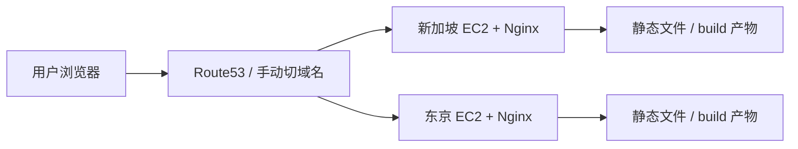
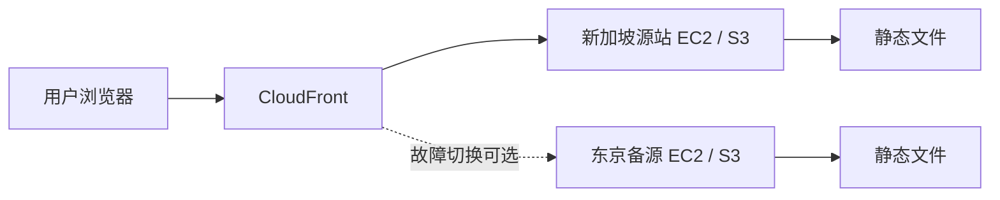

# AWS 双区域模拟方案（Nginx / CDN）

这份文档只回答一个问题：

> 对于 `delivery-preview-server.js` 里的 `nginx` 和 `cdn` 两个场景，怎么用 AWS 模拟成“两个区域节点、几台机器”的真实部署结构？

---

## 1. 先说结论

如果你只是为了**教学 / 演示 / 理解交付链路**，最简单有效的做法是：

### 场景 A：Nginx 模拟

用 **2 个区域 + 每个区域 1 台 EC2** 就够了。

也就是：

- `ap-southeast-1`（新加坡）1 台
- `ap-northeast-1`（东京）1 台

总共：**2 台机器**

### 场景 B：CDN 模拟

如果你要“更像真实 CDN”，建议：

- 1 个源站区域
- 1 个备源区域（可选）
- 前面挂 CloudFront

最小版：

- `ap-southeast-1`：1 台源站 EC2
- `ap-northeast-1`：1 台备源 EC2（可选）
- CloudFront：全球边缘节点（AWS 托管）

总共：

- **最小 1~2 台机器 + CloudFront**

所以一句话：

- **Nginx 场景：2 台 EC2 最合适**
- **CDN 场景：1 个源站 + CloudFront，想更真实再加第 2 区域源站**

---

## 2. 你现在这个脚本在模拟什么

`delivery-preview-server.js` 其实是在模拟不同交付层的缓存策略：

- `node`：简单静态服务
- `nginx`：更像源站静态服务器
- `cdn`：更像边缘缓存

关键差异体现在响应头：

- `Cache-Control`
- `X-Cache`
- `Age`
- `X-Serve-Reason`

所以你在 AWS 上不需要 100% 复制内部实现，而是要复制**交付拓扑**。

---

## 3. 场景 A：Nginx 双区域模拟

## 目标

模拟两个区域各自有自己的静态站点入口。

适合演示：

- 源站部署
- 不同区域访问延迟
- Nginx 静态缓存策略
- 双区域部署但没有 CDN 时的效果

---

## 结构图



---

## 推荐资源

### 区域

- `ap-southeast-1`（Singapore）
- `ap-northeast-1`（Tokyo）

### 机器数

- 新加坡：1 台 EC2
- 东京：1 台 EC2

总计：**2 台 EC2**

### 机器规格

演示环境建议：

- `t3.micro` 或 `t4g.micro`
- Ubuntu 22.04

如果只是静态文件分发，完全够用。

---

## 每台机器部署什么

每台机器都部署：

- Nginx
- 一份构建好的前端静态资源

如果你想完全贴合当前脚本的语义，可以：

- Node 只负责 build 产物生成
- 线上实际由 Nginx 托管静态文件

### Nginx 行为建议

#### HTML
- `Cache-Control: no-cache`

#### 带 hash 的 JS/CSS
- `Cache-Control: public, max-age=31536000, immutable`

#### 普通静态资源
- `Cache-Control: public, max-age=300`

这和你脚本里 `nginx` 模式的语义是对齐的。

---

## 怎么访问

你有两种方式：

### 方式 1：两个独立域名

比如：

- `sg-demo.example.com`
- `tk-demo.example.com`

优点：
- 最直观
- 最方便比对两个区域

### 方式 2：一个主域名 + Route53 延迟路由

比如：

- `demo.example.com`

Route53 根据用户位置把流量导向新加坡或东京。

优点：
- 更接近真实多区域部署

但演示时不如双域名直接。

### 我建议

**先双域名。**

因为教学和验证更清楚。

---

## 4. 场景 B：CDN 双区域模拟

## 目标

模拟“源站 + CDN 边缘缓存”的结构。

适合演示：

- CDN 为什么比直接访问源站快
- HTML 与静态资源的不同缓存策略
- X-Cache / Age 这类头部代表什么
- 全球边缘节点如何吃掉静态请求

---

## 最推荐结构



---

## 方案 B1：最简单的 CDN 模拟

### 资源

- 新加坡：1 台源站 EC2
- CloudFront：1 个分发

总计：**1 台 EC2 + 1 个 CloudFront**

### 适合什么

- 你只是要解释 CDN
- 不追求双源站高可用
- 想先看缓存命中效果

### 这已经够演示

因为 CloudFront 自己就是全球边缘网络。

只要前面有 CloudFront，后面的“多个边缘节点”已经由 AWS 帮你实现了。

所以严格说：

> CDN 场景不需要你自己买很多区域机器来模拟边缘节点。

---

## 方案 B2：更像真实生产的 CDN 模拟

### 资源

- 新加坡：1 台源站 EC2
- 东京：1 台备源 EC2
- CloudFront：1 个分发
- Route53 / Origin failover（可选）

总计：**2 台 EC2 + 1 个 CloudFront**

### 适合什么

- 你想模拟源站容灾
- 你想讲“CDN 前面是边缘，后面可以挂多区域源站”

---

## CDN 场景里每层干什么

### CloudFront

负责：

- 边缘缓存
- 回源
- 返回 `X-Cache`
- 降低用户到源站的延迟

### 源站 EC2 / Nginx

负责：

- 提供原始 HTML / JS / CSS / 图片
- 决定源站缓存头

### 双区域源站（可选）

负责：

- 备份
- 容灾
- 区域切换

---

## 5. 如果你问“到底几个机器最合适”

我给你一个最务实答案：

## 为了演示 `nginx`

### 最小配置
- 2 个区域
- 2 台 EC2

### 作用
- 展示双区域源站
- 比较区域访问
- 看源站静态缓存策略

---

## 为了演示 `cdn`

### 最小配置
- 1 台源站 EC2
- 1 个 CloudFront

### 更完整配置
- 2 个区域
- 2 台 EC2
- 1 个 CloudFront

### 作用
- 展示边缘缓存
- 展示回源
- 展示 CDN 与源站的区别
- 如果双源站，再讲容灾

---

## 6. 推荐你的最终组合

如果你想同时把 **nginx** 和 **cdn** 两个场景都讲清楚，我建议直接这样配：

### 区域
- `ap-southeast-1`
- `ap-northeast-1`

### 机器
- EC2-SG-NGINX
- EC2-TK-NGINX

### CDN
- CloudFront 分发 1 个

### 总资源
- **2 台 EC2 + 1 个 CloudFront**

这样你能同时演示：

#### Nginx 模式
- 直接访问新加坡源站
- 直接访问东京源站

#### CDN 模式
- 访问 CloudFront
- CloudFront 回源到新加坡
- 东京作为备源或对照源

这是我觉得**最平衡**的方案。

---

## 7. 域名建议

你可以这样分：

- `sg-static.example.com` -> 新加坡 Nginx
- `tk-static.example.com` -> 东京 Nginx
- `cdn.example.com` -> CloudFront

这样一眼就清楚：

- 直连源站是什么效果
- 走 CDN 是什么效果

---

## 8. 文件部署方式

每台 EC2 上建议目录：

```text
/var/www/delivery-preview/
  index.html
  assets/*.js
  assets/*.css
```

Nginx root 指向这个目录。

如果你想更贴近工程化：

- 本地 build
- rsync/scp 到两台 EC2
- reload nginx

如果想更稳：

- build 后上传到 S3
- EC2 拉取
- 或者直接 S3 做源站

但为了先模拟清楚，**EC2 + Nginx 就够了**。

---

## 9. 这个场景里各组件分别对应你脚本里的哪个模式

### `nginx` 模式
对应：

- EC2 + Nginx 直出静态文件

### `cdn` 模式
对应：

- CloudFront + 源站 Nginx

### `node` 模式
如果你也想演示，可以单独在某台机器起 Node 静态服务，对比它和 Nginx 的差别。

但如果你这轮只做 `nginx` 和 `cdn`，可以不做 node 线上版。

---

## 10. 我建议你怎么落地

### 最小落地顺序

#### 第一步
先起两台 EC2：
- 新加坡
- 东京

#### 第二步
两台都装 Nginx，部署同一份静态文件

#### 第三步
先验证 Nginx 源站模式
- `sg-static`
- `tk-static`

#### 第四步
前面加一个 CloudFront
- 回源到新加坡
- 东京做备源或备用实验

#### 第五步
用浏览器 Network 面板对比：
- 源站访问
- CDN 访问
- Cache-Control
- X-Cache
- Age

---

## 11. 最短结论

如果你要用 AWS 模拟这两个场景：

### Nginx 场景
- **2 个区域，2 台 EC2**

### CDN 场景
- **1 个 CloudFront + 1 台源站 EC2** 就能成立
- 想更真实，再加第 2 区域源站

### 最推荐整体方案
- **新加坡 1 台 EC2**
- **东京 1 台 EC2**
- **CloudFront 1 个分发**

这套最适合同时讲清：

- 多区域源站
- Nginx 静态分发
- CDN 边缘缓存
- 回源关系
- 命中 / 未命中差异
