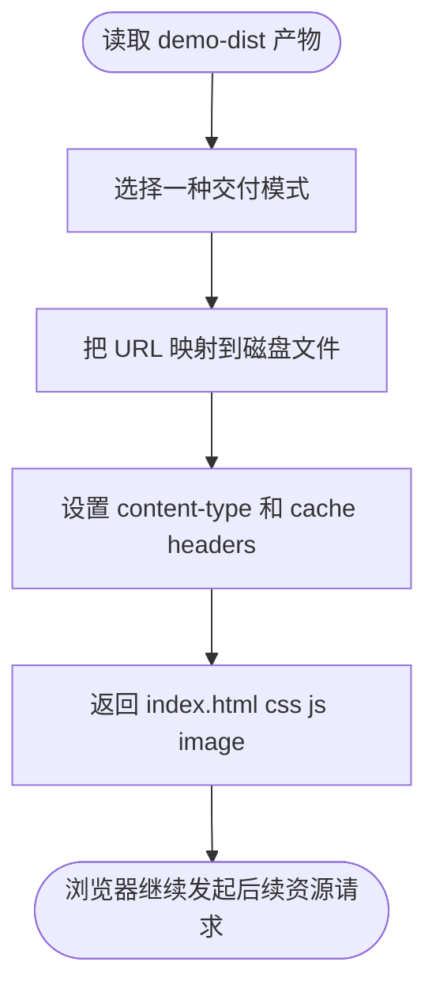

# 3-serve-files-via-dev-server-node-nginx-cdn

> 目标：用一份**已经构建好的最小静态产物**，模拟 **dev server / Node 静态服务 / Nginx 风格托管 / CDN 边缘缓存** 如何把这些文件暴露给浏览器。

## 目录结构

```text
3-serve-files-via-dev-server-node-nginx-cdn/
├─ README.md
├─ package.json
├─ delivery-modes-report.js
├─ delivery-preview-server.js
└─ demo-dist/
   ├─ index.html
   ├─ css/
   │  └─ app.84d7a5c1.css
   ├─ js/
   │  └─ app.12ab34cd.js
   └─ images/
      └─ logo.77aa33ff.svg
```

这里只有四类核心东西：

- `demo-dist/`：假定已经构建完成的一组最小产物
- `delivery-modes-report.js`：手写版说明脚本，输出 4 种交付方式的差异
- `delivery-preview-server.js`：手写最小 HTTP 服务，模拟不同交付层的响应行为
- `package.json`：当前场景自己的运行命令

---

## 1. 这一跳在全链路里的位置


这个场景只讲：

- 一组已经构建好的文件如何映射到公共 URL
- 服务端如何返回 `index.html`
- 浏览器如何继续请求 `CSS / JS / 图片`
- 不同交付层如何体现在缓存策略和响应头上

这个场景不讲：

- 这些文件是怎么构建出来的
- 浏览器如何解析这些字节
- DOM / CSSOM / 渲染 / 水合

输入：

- `demo-dist/index.html`
- `demo-dist/css/app.84d7a5c1.css`
- `demo-dist/js/app.12ab34cd.js`
- `demo-dist/images/logo.77aa33ff.svg`

输出：

- 本地可访问的 4 组 URL
- 4 种交付模式的响应头差异
- 一份结构化 JSON，用来对照“同一份产物如何被不同方式暴露”

---

## 2. 为什么需要这一跳

构建完成并不等于浏览器已经拿到了文件。

在浏览器真正看到页面之前，还需要一个“把文件暴露出去”的层：

- 本地开发时可能是 dev server
- 简单部署时可能是 Node 静态服务
- 线上常见的是 Nginx
- 离用户更近时常常还会经过 CDN

所以这一跳的核心不是“生成文件”，而是：

> **把已经存在的构建产物，变成浏览器可以通过 HTTP 请求拿到的 URL 和字节流。**

---

## 3. 手写最小实现做了什么



### `delivery-modes-report.js`

它不会启动服务器，只做一件事：

- 输出同一份 `demo-dist/` 在 4 种交付模式下的职责差异

### `delivery-preview-server.js`

它会真的启动一个最小 HTTP 服务，并按不同模式切换响应策略：

- `dev`
- `node`
- `nginx`
- `cdn`

关键不是把服务端写复杂，而是让读者看到：

- URL 是怎么对应到文件的
- 不同交付层为什么会有不同缓存策略
- 同样的 `index.html`、`css`、`js`、`svg`，可以被不同服务层重新包装后再交给浏览器

---

## 4. 四种模式分别在模拟什么

### dev server

- 目标：本地开发时尽快把最新文件给浏览器
- 特点：`no-store`
- 重点：开发体验优先，不强调长缓存

### Node 静态服务

- 目标：用一个简单应用服务直接把文件读出来
- 特点：最少逻辑，最接近“自己写一个静态服务器”
- 重点：说明“Node 也可以直接暴露构建产物”

### Nginx 风格静态托管

- 目标：让 HTML 和带 hash 的静态资源采用不同缓存策略
- 特点：HTML `no-cache`，hash 资源长期缓存
- 重点：说明线上静态托管更关心稳定和缓存命中

### CDN 边缘缓存

- 目标：在离用户更近的位置重复分发同一份文件
- 特点：模拟 `X-Cache: MISS -> HIT`
- 重点：说明 CDN 不是重新构建文件，而是重新暴露同一份源站产物

---

## 5. 输入和请求链示意

### 最小产物目录

```text
demo-dist/
├─ index.html
├─ css/app.84d7a5c1.css
├─ js/app.12ab34cd.js
└─ images/logo.77aa33ff.svg
```

### 浏览器请求顺序

```text
GET /
-> index.html
-> GET /css/app.84d7a5c1.css
-> GET /js/app.12ab34cd.js
-> CSS 继续触发 GET /images/logo.77aa33ff.svg
-> 用户点击按钮后 JS 再请求一次 /images/logo.77aa33ff.svg
```

这里故意让 `CSS` 和 `JS` 都参与后续请求，是为了说明：

- 服务层面对的是“文件交付”
- 不管这些请求是 HTML 触发、CSS 触发，还是 JS 触发，本质上都要通过 HTTP 返回字节

---

## 6. 手写方案 vs 实际流行方案

| 对比项 | 手写最小方案 | 实际流行方案 |
|---|---|---|
| 目标 | 讲清“产物如何被暴露给浏览器” | 在真实环境里稳定、高效地交付静态文件 |
| 输入 | 一份人工收敛的 `demo-dist/` | 多页面、多版本、多地域的大规模构建产物 |
| 核心动作 | URL 映射、返回文件、设置响应头 | URL 映射、压缩、缓存、证书、代理、日志、限流等 |
| 省略内容 | TLS、gzip/brotli、代理回源、监控、健康检查、配置热更新 | 真实线上通常都需要 |
| 输出 | 本地可访问的 4 个演示服务 | 可直接承载真实用户流量的交付层 |
| 价值 | 便于观察 dev server / Node / Nginx / CDN 的共同主线 | 便于真实开发、部署、缓存优化和全球分发 |

四句总结：

1. 手写方案复现了“把构建产物通过 HTTP 暴露出去”这个最核心动作。
2. 它故意省掉了 TLS、压缩、代理、监控、配置系统等大量工程能力。
3. 真实流行方案会把这些工程能力全部补齐，并进一步做缓存和回源优化。
4. 手写版适合教学和调试，真实方案适合开发环境与线上交付。

---

## 7. 怎么运行

```bash
cd /Users/liu/Desktop/simulation-frontend/scenarios/3-serve-files-via-dev-server-node-nginx-cdn
pnpm mini
pnpm serve:dev
pnpm serve:node
pnpm serve:nginx
pnpm serve:cdn
```

运行后可以这样看：

- `pnpm mini`
- 输出结构化 JSON，总结 4 种交付方式的职责差异

- `pnpm serve:dev`
- 打开 `http://127.0.0.1:4301`
- 看 `Cache-Control: no-store`

- `pnpm serve:node`
- 打开 `http://127.0.0.1:4302`
- 看最朴素的 Node 静态文件暴露方式

- `pnpm serve:nginx`
- 打开 `http://127.0.0.1:4303`
- 看 HTML 和 hash 资源缓存策略不同

- `pnpm serve:cdn`
- 打开 `http://127.0.0.1:4304`
- 重复刷新同一个资源，观察 `X-Cache` 从 `MISS` 到 `HIT`

建议直接打开浏览器 Network 面板，对比响应头：

- `X-Delivery-Mode`
- `Cache-Control`
- `X-Serve-Reason`
- `X-Cache`
- `Age`

---

## 8. 最后的结论

这个场景不是为了造一个真正替代 dev server、Nginx 或 CDN 的交付系统，而是为了说明：

> **构建产物生成之后，还必须通过某种服务层把它们映射成浏览器可请求的 URL，并以合适的响应头和缓存策略交付出去。**

而这个场景里：

- `demo-dist/` 负责提供最小静态产物输入
- `delivery-modes-report.js` 负责把 4 种交付方式的职责讲透
- `delivery-preview-server.js` 负责把这些交付差异变成可以实际访问的本地 HTTP 服务
