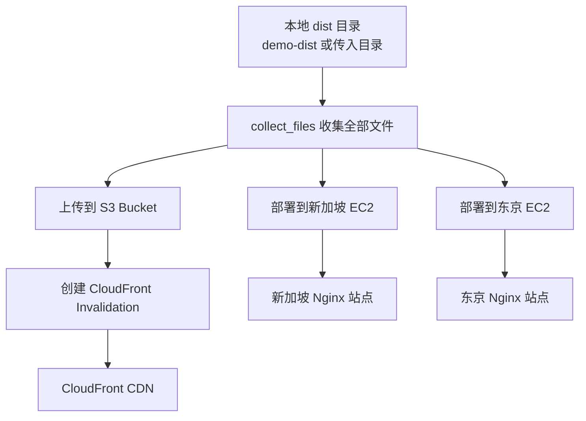
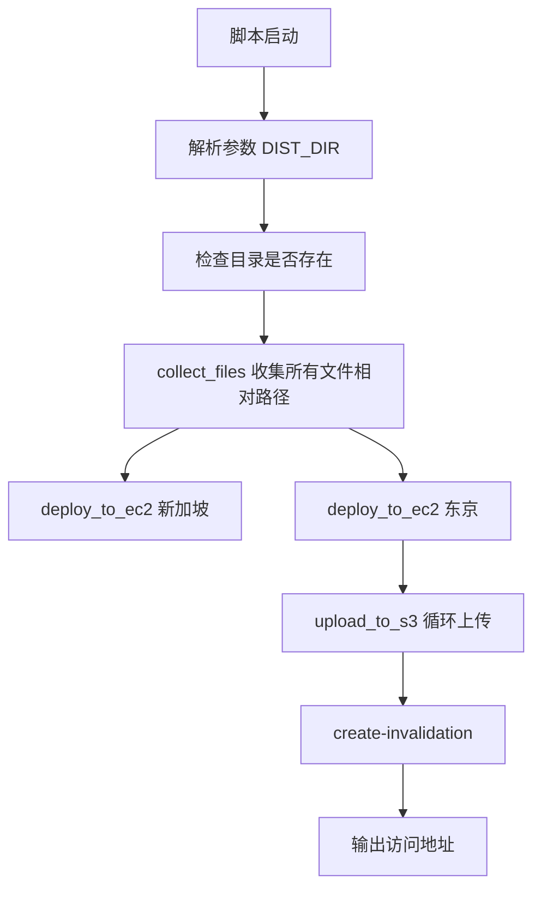
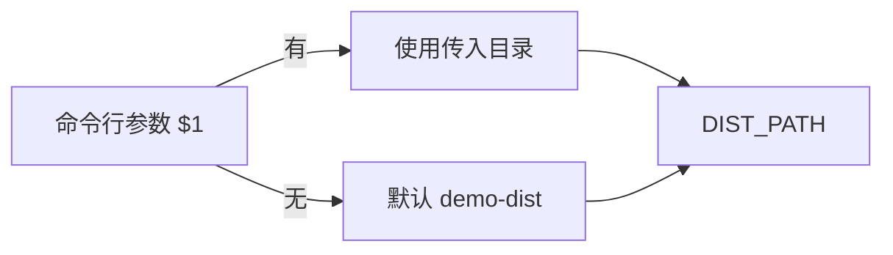
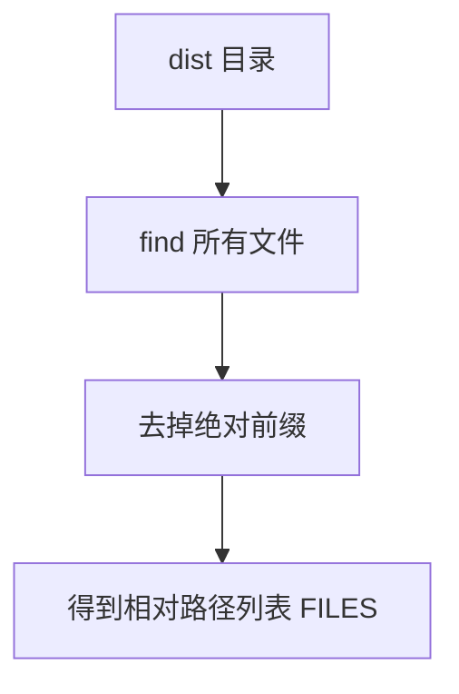
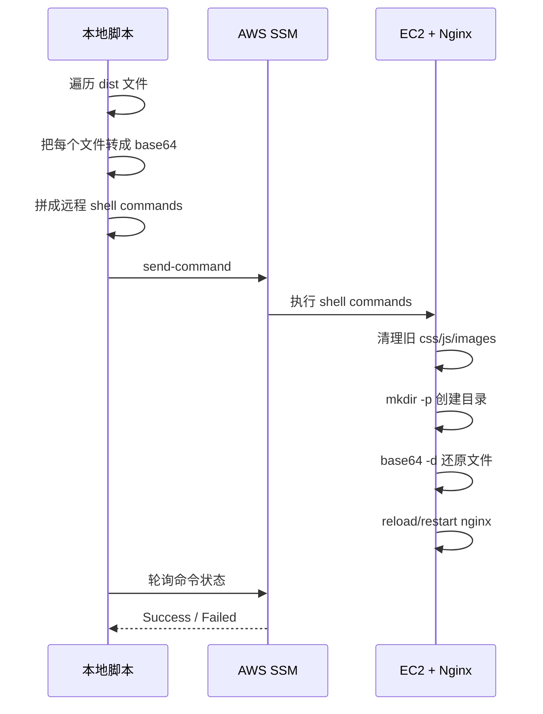
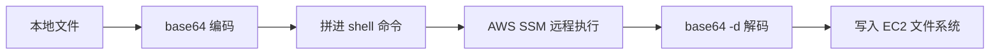
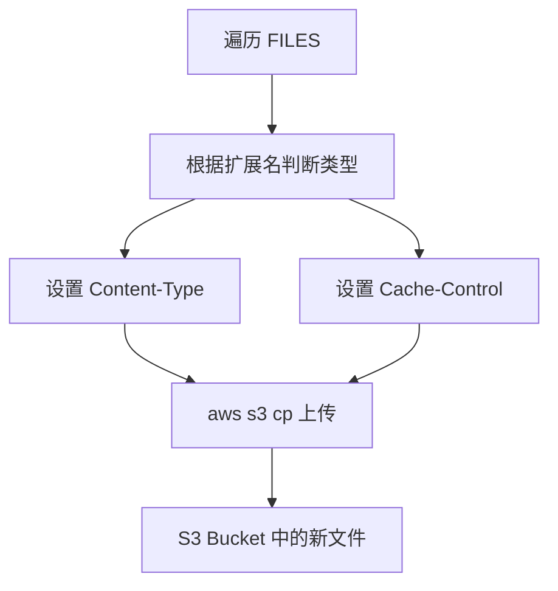
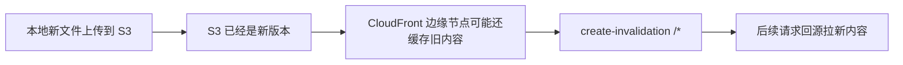
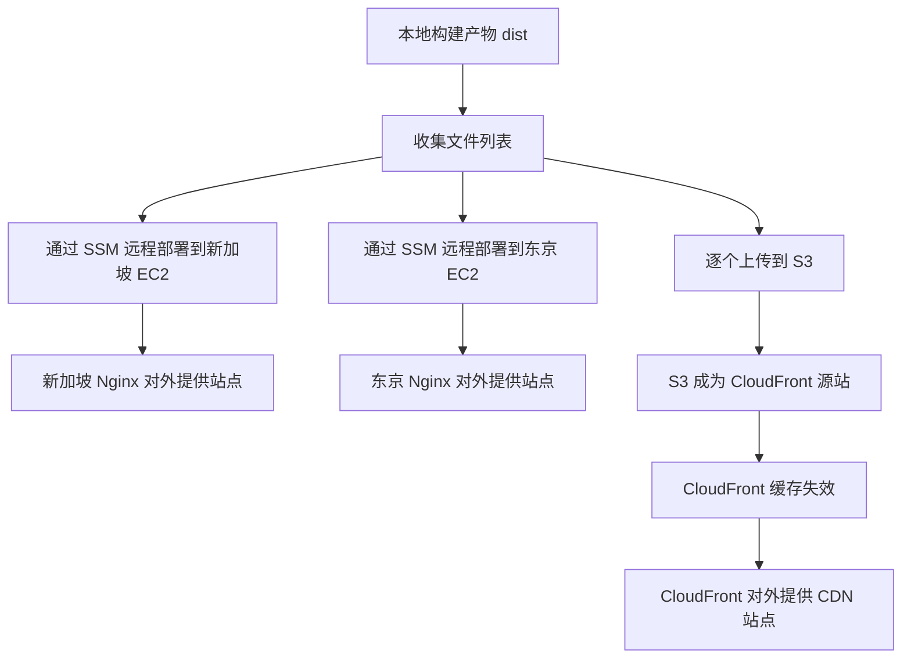

# `deploy-to-aws.sh` 图解

这份文档是对下面这个脚本的图解说明：

- `/Users/liu/Desktop/simulation-frontend/scenarios/3-serve-files-via-dev-server-node-nginx-cdn/deploy-to-aws.sh`

它的目标很直接：

> 把本地 `demo-dist` 这类静态构建产物，一次性发布到两类 AWS 目标：
>
> 1. 两台 Nginx EC2（新加坡 / 东京）
> 2. 一个 S3 + CloudFront 的 CDN 链路

也就是说，这个脚本不是“创建基础设施”的。
它是**往已经存在的 AWS 资源里发版**。

---

## 1. 一句话理解这个脚本

这个脚本做了三件事：

1. **收集本地 dist 文件**
2. **把这些文件发到两台 EC2 上的 Nginx 目录**
3. **把同一批文件上传到 S3，并让 CloudFront 失效缓存**

所以它本质上是一个：

- **双源站 + CDN 的静态站发布脚本**

---

## 2. 总体流程图



---

## 3. 这个脚本依赖哪些“前提条件”

脚本里把目标资源写死了，所以它默认你已经有这些资源：

```bash
SG_INSTANCE="i-0fbc94f2382670640"
SG_REGION="ap-southeast-1"
TK_INSTANCE="i-0ae6bb7c3b0283e61"
TK_REGION="ap-northeast-1"
S3_BUCKET="delivery-sim-20260415111154-7vp5z8-cdn-origin"
S3_REGION="ap-southeast-1"
CF_DISTRIBUTION="E1GWJHGHPG17NW"
NGINX_ROOT="/usr/share/nginx/html"
```

这表示：

- 新加坡有一台 EC2，里面跑着 nginx
- 东京有一台 EC2，里面跑着 nginx
- 有一个 S3 bucket 当 CDN 源站
- 有一个 CloudFront distribution 挂在 S3 前面

所以这个脚本的角色是：

- **部署器**
- 不是**建站器**

---

## 4. 脚本结构图



---

# 5. 分段解释

## 5.1 输入目录解析

脚本开头：

```bash
SCRIPT_DIR="$(cd "$(dirname "$0")" && pwd)"
DIST_DIR="${1:-demo-dist}"
DIST_PATH="$SCRIPT_DIR/$DIST_DIR"
```

意思是：

- 脚本所在目录记为 `SCRIPT_DIR`
- 如果你传了第一个参数，就把它当成 dist 目录名
- 如果没传，就默认用 `demo-dist`
- 最终发布目录是：
  - `脚本所在目录/demo-dist`
  - 或 `脚本所在目录/你传入的目录`

### 图



### 例子

```bash
./deploy-to-aws.sh
```

等价于：

- 发布 `demo-dist`

```bash
./deploy-to-aws.sh my-dist
```

等价于：

- 发布 `my-dist`

---

## 5.2 目录存在性检查

```bash
if [ ! -d "$DIST_PATH" ]; then
  echo "错误: 目录不存在 $DIST_PATH"
  exit 1
fi
```

这一步很朴素：

- 如果你要发的目录不存在，直接报错退出
- 避免后面上传空目录、误操作、生成奇怪结果

---

## 5.3 `collect_files`：先把待发布文件列出来

```bash
collect_files() {
  local base="$1"
  find "$base" -type f | while read -r f; do
    echo "${f#$base/}"
  done
}
```

### 责任

把 dist 目录下的所有文件，变成**相对路径列表**。

### 输入 / 输出

- 输入：dist 根目录
- 输出：相对路径列表，例如：
  - `index.html`
  - `css/app.84d7a5c1.css`
  - `js/app.12ab34cd.js`
  - `images/logo.77aa33ff.svg`

### 为什么必须这么做

因为后面无论是：

- 推送到 EC2
- 上传到 S3

都需要知道“有哪些文件”和“它们的相对路径结构”。

### 图



---

## 5.4 部署到 EC2：核心思路

脚本里最关键的是这个函数：

```bash
deploy_to_ec2() {
  local region="$1" instance="$2" label="$3"
  ...
}
```

它不是用 `scp` 或 `rsync`。
它用的是：

- **AWS SSM send-command**

也就是：

- 从本地生成一串 shell 命令
- 让 AWS SSM 远程在目标 EC2 上执行这些命令

这有个明显好处：

- 不依赖 SSH 登录
- 不需要本地持有私钥
- 只要 EC2 已接入 SSM，就能远程发命令

---

## 5.5 EC2 部署流程图



---

## 5.6 EC2 这一步到底做了什么

### 第一步：先删旧资源目录

```bash
commands+=("rm -rf $NGINX_ROOT/css $NGINX_ROOT/js $NGINX_ROOT/images")
```

这里的意图是：

- 先把旧的资源目录删掉
- 避免旧 hash 文件残留

为什么只删这几个目录，不删整个 `/usr/share/nginx/html`？

因为脚本作者显然想保守一点：

- 删静态资源目录
- 重新写入新的 `css/js/images`
- `index.html` 直接覆盖

### 这一步的风险点

如果以后 dist 目录里新增了别的一级目录，比如：

- `fonts/`
- `assets/`
- `icons/`

那它们不会被这句 `rm -rf` 清掉，可能留下历史垃圾文件。

也就是说，这个脚本目前是：

- **能用**
- 但对目录结构有一点“写死假设”

---

## 5.7 为什么要把文件转成 base64

关键代码：

```bash
content=$(base64 < "$DIST_PATH/$rel")
commands+=("echo '$content' | base64 -d > $NGINX_ROOT/$rel")
```

### 原理

本地先把文件内容编码成 base64 文本；
远端再 `base64 -d` 解回原文件。

### 为什么这样做

因为你要把文件内容塞进一条远程 shell 命令里。

直接传原始内容会遇到很多问题：

- 换行
- 引号
- 特殊字符
- 二进制文件

base64 会把这些问题统一变成“纯文本安全传输”。

### 图



---

## 5.8 为什么还要 `mkdir -p`

```bash
if [ "$dir" != "." ]; then
  commands+=("mkdir -p $NGINX_ROOT/$dir")
fi
```

因为相对路径可能是：

- `css/app.84d7a5c1.css`
- `images/logo.77aa33ff.svg`

在写文件之前，目录必须先存在。

这一步就是确保：

- `css/`
- `js/`
- `images/`

这些目录都已经建好。

---

## 5.9 为什么最后要 reload nginx

```bash
commands+=("nginx -s reload 2>&1 || systemctl restart nginx 2>&1")
```

这句的逻辑是：

- 优先尝试平滑 reload nginx
- 如果 reload 不成功，再直接 restart

### 这样设计的原因

因为有些实例环境里：

- nginx 进程已经在跑，适合 reload
- 也可能 nginx 没起来，或状态不对，这时 restart 更稳

所以这是一个“先优雅、后兜底”的写法。

---

## 5.10 为什么要轮询命令状态

```bash
for i in $(seq 1 30); do
  sleep 2
  status=$(aws ssm get-command-invocation ...)
  ...
done
```

因为 `send-command` 只是把任务丢给 SSM，**不是同步执行完成**。

所以脚本必须自己等待，直到拿到：

- `Success`
- 或 `Failed`

### 这个轮询窗口多大

- 最多 30 次
- 每次等 2 秒
- 总等待约 **60 秒**

如果 60 秒还没结束，就会按失败处理。

### 这说明什么

这个脚本假设：

- dist 文件不大
- 远程写入很快
- nginx reload 很快

对你这个 demo 场景是成立的。

---

## 5.11 两台 EC2 是串行部署，不是并行

```bash
deploy_to_ec2 "$SG_REGION" "$SG_INSTANCE" "新加坡"
deploy_to_ec2 "$TK_REGION" "$TK_INSTANCE" "东京"
```

这说明发布顺序是：

1. 先新加坡
2. 再东京

不是同时发。

### 影响

优点：

- 日志更清晰
- 出错时更容易定位是哪一站失败

缺点：

- 总耗时会比并行多一点

对演示和小规模脚本来说，这种串行方式是合理的。

---

# 6. 上传到 S3：这一步在做什么

EC2 部署完之后，脚本开始做 CDN 源站同步。

```bash
upload_to_s3() {
  local rel="$1"
  local ext="${rel##*.}"
  ...
  aws s3 cp ...
}
```

### 责任

逐个文件上传到 S3，并按文件类型设置：

- `Content-Type`
- `Cache-Control`

### 这一步非常关键

因为 CloudFront 的缓存行为，很多时候就是依赖源站返回的这些头。

---

## 6.1 S3 上传流程图



---

## 6.2 文件类型和缓存策略怎么映射

脚本里是这样写的：

```bash
case "$ext" in
  html) cache_control="no-cache" ;;
  css)  cache_control="public, max-age=31536000, immutable" ;;
  js)   cache_control="public, max-age=31536000, immutable" ;;
  svg)  cache_control="public, max-age=31536000, immutable" ;;
  json) cache_control="public, max-age=300" ;;
  *)    cache_control="public, max-age=300" ;;
esac
```

### 它表达的原则

#### HTML
- 不做强缓存
- 因为 HTML 经常是入口文件，需要尽快拿到新版本

#### CSS / JS / SVG
- 长缓存 + immutable
- 因为这些通常带 hash，文件名变了就说明内容变了

#### JSON / 其他文件
- 中等缓存
- 既不是入口页，也不一定是内容哈希资源

这和你 `delivery-preview-server.js` 的思路是一致的。

---

# 7. 为什么 S3 上传后还要做 CloudFront Invalidation

```bash
INVALIDATION_ID=$(aws cloudfront create-invalidation \
  --distribution-id "$CF_DISTRIBUTION" \
  --paths "/*" \
  --query 'Invalidation.Id' --output text)
```

### 责任

告诉 CloudFront：

- 把旧缓存尽快作废
- 下次用户请求时重新回源拿最新文件

### 为什么有这一步

因为即便 S3 已经是新文件了，CloudFront 边缘节点上仍可能还留着旧缓存。

如果不失效，你会碰到这种情况：

- S3 里已经更新了
- 但用户访问 CloudFront 还是旧页面

### 图



---

# 8. 整个发布链路图



---

# 9. 从“交付层”角度理解这个脚本

这个脚本其实在同时维护两条访问链路：

## 链路 A：源站直连

```text
用户 -> EC2 + Nginx -> 静态文件
```

用于模拟：

- `nginx` 场景
- 双区域源站
- 不经过 CDN 时的直接访问

## 链路 B：CDN 分发

```text
用户 -> CloudFront -> S3
```

用于模拟：

- `cdn` 场景
- 边缘缓存
- 源站 + CDN 的交付路径

所以这个脚本的核心价值是：

- **一份 dist，同时发两种交付模式**

---

# 10. 这个脚本的优点

## 优点 1：简单直接

不用额外部署 CI/CD 平台，直接一条脚本就能发。

## 优点 2：不依赖 SSH

EC2 发布走的是 SSM，不需要：

- 开 SSH 会话
- 管私钥
- 手工 scp

## 优点 3：CDN 侧考虑了缓存失效

不是只上传 S3，就完事了。
还额外做了 CloudFront invalidation。

## 优点 4：源站和 CDN 同步更新

同一次部署，会同时更新：

- 新加坡源站
- 东京源站
- S3 源站
- CloudFront 缓存状态

---

# 11. 这个脚本的局限 / 风险点

## 风险 1：资源 ID 写死

脚本里这些都是写死的：

- 实例 ID
- Region
- S3 bucket
- CloudFront distribution

这意味着：

- 换环境就得改脚本
- 一旦资源被重建，脚本就失效

更稳妥的做法通常是：

- 用配置文件
- 或 `.env`
- 或按环境区分 dev/staging/prod

---

## 风险 2：EC2 目录清理规则不够泛化

只删了：

- `css`
- `js`
- `images`

如果以后 dist 里新增：

- `assets`
- `fonts`
- `media`

旧文件可能残留。

---

## 风险 3：SSM 传大文件不够优雅

现在每个文件都是：

- 先 base64
- 再塞到命令里
- 再远端解码

对于 demo 小文件完全没问题。
但如果 dist 很大，可能会遇到：

- 命令过长
- 执行慢
- 调试麻烦

更大的项目通常会改成：

- 先上传压缩包到 S3
- EC2 再从 S3 拉取并解压

---

## 风险 4：CloudFront 失效范围过大

现在用的是：

```bash
--paths "/*"
```

这表示整个站点全部失效。

优点：
- 简单
- 不会漏

缺点：
- 粒度粗
- 请求多时不够经济

更精细的做法会只失效：

- `/index.html`
- 或少量入口文件

因为 hash 资源理论上可以长期缓存，不一定要清。

---

# 12. 如果把它当成“发布系统”，它的职责边界是什么

这个脚本只负责：

- 发布文件
- 刷新 CDN 缓存

它**不负责**：

- 创建 AWS 基础设施
- 创建/更新安全组
- 创建 EC2 / S3 / CloudFront
- 切换域名
- 健康检查
- 回滚版本

所以它更准确的定位应该是：

- **Deploy script**
- 不是完整的 infra-as-code

---

# 13. 最后用一句话概括

`deploy-to-aws.sh` 的本质是：

> 把本地静态产物同时发布到“两台 Nginx EC2 源站”和“一套 S3 + CloudFront CDN”，并通过 SSM 和 CloudFront Invalidation 完成一次完整发版。

如果你要继续，我下一步可以直接帮你补两种东西：

1. **把这个脚本改成可复用版**
   - 支持 `.env`
   - 支持多环境
   - 支持更稳的清理策略

2. **再画一版“请求从浏览器到 AWS 的访问路径图”**
   - 偏前端交付链路
   - 更适合拿来讲课或写 README
