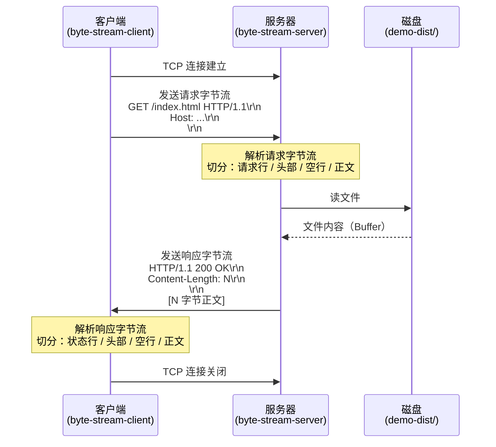

# 4-browser-initiates-request-and-receives-bytes

## 目标

模拟浏览器发起 HTTP 请求、服务器返回字节流的完整过程。

这一跳聚焦在**网络传输层**：HTTP 请求和响应在 TCP 层面长什么样，
字节流如何切分成状态行、头部、正文三段。

---

## 在线性链路中的位置

```
源码
 └─ [0] 读取源码 / 分析依赖
 └─ [1] 编译框架语法为 JS
 └─ [2] 处理 CSS / 图片 / 字体资产
 └─ [3] 产物通过服务器交付
 └─ [4] 浏览器发起请求，收到字节流   ← 本场景
 └─ [5] (后续) 解析字节流 → DOM / CSSOM → 渲染
```

- **输入**：一个可访问的 HTTP 服务器地址（`demo-dist/` 里的静态资产）
- **输出**：浏览器收到的原始字节流，以及它的结构注解
- **不负责**：字节流之后的 HTML 解析、渲染、JS 执行

---

## 目录结构

```
4-browser-initiates-request-and-receives-bytes/
├── README.md
├── package.json
├── byte-stream-server.js    # 用 raw TCP 接收请求，展示字节结构，发回响应
├── byte-stream-client.js    # 用 raw TCP 发起请求，展示发出和收到的字节
└── demo-dist/               # 被请求的静态资产（复用 scenario-3 的产物）
    ├── index.html
    ├── css/app.84d7a5c1.css
    ├── js/app.12ab34cd.js
    └── images/logo.77aa33ff.svg
```

---

## Mermaid 图



---

## HTTP/1.1 字节流结构

### 请求

```
GET /index.html HTTP/1.1\r\n        ← 请求行（方法 路径 协议版本）
Host: 127.0.0.1:4400\r\n           ← 头部（Key: Value）
Accept: text/html\r\n              ← 头部
\r\n                               ← 空行（标志头部结束）
                                   ← 正文（GET 通常没有）
```

### 响应

```
HTTP/1.1 200 OK\r\n                ← 状态行（协议版本 状态码 描述）
Content-Type: text/html\r\n        ← 头部
Content-Length: 646\r\n            ← 头部（告知正文字节数）
\r\n                               ← 空行（标志头部结束）
<!doctype html>...                 ← 正文（646 字节，读到这里停止）
```

**浏览器靠什么知道正文读完了？**

```
Content-Length: N     →  读满 N 字节，停止
Transfer-Encoding: chunked  →  读到 "0\r\n\r\n" 这个终止块，停止
Connection: close     →  服务器主动关闭 TCP，停止
```

---

## 手写最小实现做了什么

`byte-stream-server.js`

- 用 `net.createServer()`（原始 TCP）而非 `http.createServer()`
- 接收到字节流后，手动定位 `\r\n\r\n` 切分头部和正文
- 解析请求行和头部字段
- 从磁盘读文件，手动拼出响应字节串（状态行 + 头部 + `\r\n\r\n` + 正文）
- 打印请求字节结构注解 / 响应字节结构注解

`byte-stream-client.js`

- 用 `net.createConnection()`（原始 TCP）
- 手动把请求拼成字符串，`.write()` 发出去
- 接收所有响应字节（Buffer）
- 定位 `\r\n\r\n` 切分头部和正文
- 解析 `Content-Length`，确认读到的正文字节数是否匹配

---

## 与流行方案对比

| 对比项 | 手写最小方案 | 真实浏览器 / Node http 模块 |
|--------|-------------|--------------------------|
| 目标 | 把 HTTP 字节结构裸露出来 | 稳定、高效地收发 HTTP |
| 连接层 | 原始 TCP socket | TCP + TLS（HTTPS）、HTTP/2 多路复用 |
| 请求构造 | 手写字符串拼接 | 自动处理编码、压缩、Keep-Alive、Cookie |
| 响应解析 | 手动定位 `\r\n\r\n`、读 Content-Length | 处理 chunked、gzip、重定向、超时、流式解析 |
| 省略内容 | TLS、HTTP/2、压缩、流式大文件、Keep-Alive | 全部支持 |
| 价值 | 让"字节流"变得可见 | 让开发者不需要关心字节细节 |

---

## 怎么运行

```bash
# 终端 1：启动服务器
pnpm serve

# 终端 2：发起请求，观察字节流
pnpm request

# 或者一次性跑完整个演示（服务器 + 客户端）
pnpm mini
```

---

## 一句结论

HTTP 请求和响应都是 **有固定结构的字节串**：
`\r\n` 分隔头部字段，`\r\n\r\n` 标志头部结束，
`Content-Length` 告知正文有多少字节。
浏览器收到字节流，按这个结构拆开，才能拿到 HTML/CSS/JS 的内容。
