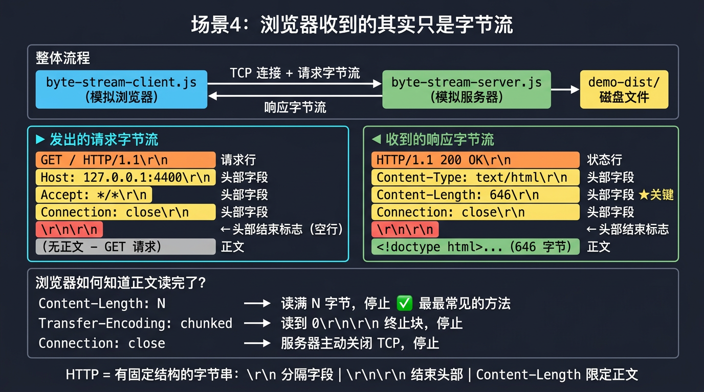

# 场景 4 图解：浏览器发起请求并收到字节流

---

## 核心图解



---

## 一、整体结构

这个场景只有两个进程，中间是一条 TCP 连接。

```
byte-stream-client.js          TCP 连接          byte-stream-server.js
（模拟浏览器）                                    （模拟服务器）

net.createConnection()  ──────────────────────►  net.createServer()
                                                  │
                                                  │  socket.on('data')
                                                  │  接收请求字节
                                                  │
                                                  │  parseHttpRequest()
                                                  │  解析请求结构
                                                  │
                                                  │  fs.readFileSync()
                                                  │  读磁盘文件
                                                  │
                                                  │  buildHttpResponse()
                                                  │  拼响应字节串
                                                  │
socket.on('data')       ◄──────────────────────  socket.write()
接收响应字节                                      发送响应字节
│
parseHttpResponse()
解析响应结构
```

---

## 二、请求字节流的结构

`byte-stream-client.js` 手动把这几个字符串用 `\r\n` 连接起来，就是一条合法的 HTTP/1.1 请求：

```
字节位置  内容                              含义
───────────────────────────────────────────────────────────────────
  0      G E T   /   H T T P / 1 . 1      请求行：方法 + 路径 + 协议版本
        \r \n                              行尾标志
        H o s t :   1 2 7 . 0 . 0 . 1    头部字段 1
        \r \n
        A c c e p t :   * / *             头部字段 2
        \r \n
        C o n n e c t i o n :  c l o s e 头部字段 3
        \r \n
        \r \n                             ← 空行，头部结束标志
                                            浏览器/服务器看到这里才知道头部结束了
                                          （GET 无正文，到这里整个请求结束）
```

用代码对应：

```
// byte-stream-client.js 第 71-78 行
const requestText = [
  `GET ${reqPath} HTTP/1.1`,   ← 请求行
  `Host: ${HOST}:${PORT}`,     ← 头部字段
  `Accept: */*`,               ← 头部字段
  `Connection: close`,         ← 头部字段
  ``,                          ← 空行（join 后变成 \r\n\r\n）
  ``,
].join('\r\n');
```

---

## 三、服务器解析请求字节的过程

```
收到的原始 Buffer：
┌─────────────────────────────────────────────────────────────┐
│ GET / HTTP/1.1\r\nHost: ...\r\nAccept: ...\r\n\r\n          │
└─────────────────────────────────────────────────────────────┘
        │
        │  raw.indexOf('\r\n\r\n')
        │  找到 \r\n\r\n 的位置（假设在第 72 字节处）
        │
        ├── 0  ~ 71  → 头部区域
        │              再按 \r\n 逐行切割：
        │              lines[0] = "GET / HTTP/1.1"      → 请求行
        │              lines[1] = "Host: 127.0.0.1:4400" → 头部字段
        │              lines[2] = "Accept: */*"          → 头部字段
        │              ...
        │
        └── 76 ~ 末尾 → 正文区域（GET 请求这里是空的）
```

对应代码：

```
// byte-stream-server.js 第 51-73 行
const headerBodySep = raw.indexOf('\r\n\r\n');   ← 定位分隔符
const headerSection = raw.slice(0, headerBodySep); ← 切出头部
const body          = raw.slice(headerBodySep + 4); ← 切出正文

const lines = headerSection.split('\r\n');
const [method, reqPath, httpVersion] = lines[0].split(' '); ← 解析请求行
// lines[1..] 解析为 headers 字典
```

---

## 四、服务器构造响应字节的过程

```
buildHttpResponse(200, 'OK', headers, bodyBuffer)
        │
        │  第一步：拼文本头部块
        │
        │  "HTTP/1.1 200 OK\r\n"              ← 状态行
        │  "Content-Type: text/html\r\n"      ← 头部字段
        │  "Content-Length: 646\r\n"          ← 告知正文字节数
        │  "Connection: close\r\n"
        │  "\r\n"                             ← 头部结束标志
        │
        │  → Buffer.from(headerBlock, 'utf-8')  纯文本 → Buffer
        │
        │  第二步：拼二进制正文
        │
        │  bodyBuffer = fs.readFileSync(filePath)
        │               文件内容 Buffer（可能含非 UTF-8 字节）
        │
        │  第三步：合并
        │
        └─ Buffer.concat([headerBuffer, bodyBuffer])
                    │
                    ▼
           ┌────────────────────┐
           │  状态行 \r\n        │
           │  头部字段 \r\n ...  │   文本区（UTF-8）
           │  \r\n              │
           ├────────────────────┤  ← \r\n\r\n 是边界
           │  <!doctype html>   │
           │  <html>...         │   二进制区（文件原始字节）
           │  （646 字节）       │
           └────────────────────┘
                    │
                    ▼
           socket.write(responseBuffer)   ← 整个 Buffer 推入 TCP
```

---

## 五、客户端解析响应字节的过程

```
收到的完整 Buffer（745 bytes）：

┌─────────────────────────────────────────────────────────────┐
│ HTTP/1.1 200 OK\r\n                                         │  ← 状态行
│ Content-Type: text/html; charset=utf-8\r\n                  │  ← 头部字段
│ Content-Length: 646\r\n                                     │  ← 正文长度声明
│ Connection: close\r\n                                       │
│ \r\n                                                        │  ← 头部结束
│ <!doctype html><html lang="zh-CN">...                       │  ← 正文（646B）
└─────────────────────────────────────────────────────────────┘
         │
         │  raw.indexOf('\r\n\r\n')
         │  找到 \r\n\r\n（第 99 字节处）
         │
         ├── 0  ~ 98   → 头部文本（99 bytes，含末尾 \r\n\r\n）
         │               解析出 statusCode=200、headers 字典
         │               读到 Content-Length: 646
         │
         └── 99 ~ 744  → 正文字节（746 - 99 = 646 bytes）✅ 和 Content-Length 一致


Content-Length 的作用：
  浏览器不知道"服务器什么时候把正文发完"，
  但服务器在头部里提前说了"正文有 646 字节"，
  浏览器读满 646 字节之后就知道这个响应结束了，
  可以关闭连接、开始解析 HTML。
```

对应代码：

```
// byte-stream-client.js 第 37-60 行
const sepIdx     = raw.indexOf('\r\n\r\n');         ← 定位分隔符
const headerText = raw.slice(0, sepIdx);            ← 切头部
const bodyBuffer = buffer.slice(       ****             ← 切正文
  Buffer.byteLength(headerText, 'utf-8') + 4
);
const contentLength = headers['content-length'];    ← 读声明值
// 验证：bodyBuffer.length === contentLength ？
```

---

## 六、四次请求的对比

```
请求 1：GET /            → 200 OK   → 头部 99B  + 正文 646B  = 745B   (text/html)
请求 2：GET /css/...css  → 200 OK   → 头部 98B  + 正文 333B  = 431B   (text/css)
请求 3：GET /js/...js    → 200 OK   → 头部 112B + 正文 363B  = 475B   (application/javascript)
请求 4：GET /not-exist   → 404      → 头部 106B + 正文  25B  = 131B   (text/plain)

                                              ↑
                                    每次 Content-Length
                                    都和实际正文字节数完全一致 ✅
```

---

## 七、和真实浏览器的关系

```
真实浏览器                          本场景手写客户端
─────────────────────────────────────────────────────────
在地址栏输入 URL                     REQUESTS 数组里的 path
DNS 解析 + TCP 握手                  net.createConnection()
自动构造 HTTP 请求头                  手动 join('\r\n') 拼字符串
发送请求字节                         socket.write(requestText)
接收响应字节                         socket.on('data')
找到 \r\n\r\n 切分头/正文            raw.indexOf('\r\n\r\n')
读 Content-Length 判断正文结束       bodyBuffer.length === contentLength
把 HTML 交给 HTML Parser             （下一个场景的任务）
```

浏览器帮你把这些细节全部封装起来了，这里手写出来，就是为了让每一步都可见。

---

## 八、一句话总结

```
HTTP 请求/响应 = 一段有固定结构的字节串
                  │
        ┌─────────┴──────────┐
        │                    │
    头部（文本）          正文（任意字节）
    每行 \r\n 分隔        Content-Length 字节
    \r\n\r\n 结束         读完这么多字节，停止
```

---

## 九、OSI 七层模型 × 客户端 / 服务端双视角图解

> 场景 4 的两个脚本在七层模型里各自落在哪一层，做了什么，省略了什么。

```
  OSI 层         客户端 byte-stream-client.js          服务端 byte-stream-server.js
  ─────────────────────────────────────────────────────────────────────────────────

  7  应用层      ┌──────────────────────────────┐      ┌──────────────────────────────┐
  (Application)  │ 手动拼 HTTP/1.1 请求字节串    │      │ 解析 HTTP 请求字节串          │
                 │                              │      │                              │
                 │ [GET /  HTTP/1.1\r\n         │      │ raw.indexOf('\r\n\r\n')      │
                 │  Host: ...\r\n               │      │ → 切出请求行 / 头部 / 正文    │
                 │  Accept: */*\r\n             │      │                              │
                 │  Connection: close\r\n       │      │ buildHttpResponse()          │
                 │  \r\n\r\n]                   │      │ → 拼状态行 + 头部 + \r\n\r\n │
                 │                              │      │   + bodyBuffer               │
                 │ parseHttpResponse()          │      │                              │
                 │ → 切出状态行 / 头部 / 正文    │      │ fs.readFileSync(filePath)    │
                 │ → 验证 Content-Length 匹配   │      │ → 从磁盘读文件字节           │
                 └──────────────────────────────┘      └──────────────────────────────┘
                          ▲  对应代码：第 33-62 行               ▲  对应代码：第 46-88 行

  6  表示层      ✗ 场景4省略                            ✗ 场景4省略
  (Presentation) （真实：TLS加密/解密、gzip压缩/解压）   （真实：证书、加密套件协商）

  5  会话层      ✗ 场景4省略                            ✗ 场景4省略
  (Session)      （真实：Keep-Alive 连接复用管理）        （真实：连接池、会话超时）

  4  传输层      ┌──────────────────────────────┐      ┌──────────────────────────────┐
  (Transport)    │ net.createConnection()        │      │ net.createServer()           │
                 │ → 建立 TCP 连接               │      │ → 监听 TCP 端口 4400         │
                 │                              │      │                              │
                 │ socket.write(requestText)    │      │ socket.on('data', chunk)     │
                 │ → 把字节推入 TCP 发送缓冲区   │      │ → 从 TCP 接收缓冲区读字节    │
                 │                              │      │                              │
                 │ socket.on('data', chunk)     │      │ socket.write(responseBuffer) │
                 │ → 从 TCP 接收缓冲区读响应字节 │      │ → 把响应字节推入 TCP         │
                 │                              │      │                              │
                 │ socket.on('end')             │      │ socket.end()                 │
                 │ → TCP 连接关闭，响应完成      │      │ → 主动关闭连接               │
                 └──────────────────────────────┘      └──────────────────────────────┘
                          ▲  对应代码：第 96-161 行              ▲  对应代码：第 102-191 行

  3  网络层      ✗ 操作系统负责（对代码透明）           ✗ 操作系统负责（对代码透明）
  (Network)      （IP 寻址：127.0.0.1 → 127.0.0.1）

  2  数据链路层  ✗ 操作系统 / 网卡驱动负责             ✗ 操作系统 / 网卡驱动负责
  (Data Link)    （以太帧、MAC 地址）

  1  物理层      ✗ 硬件负责                            ✗ 硬件负责
  (Physical)     （电信号 / 光信号 / 回环接口 lo0）
```

---

### 场景 4 在七层模型里的"覆盖区域"

```
  层编号   层名          场景4覆盖？   代码入口
  ──────────────────────────────────────────────────────────────────────
  7        应用层        ✅ 核心       手写 HTTP 字节串的拼接与解析
  6        表示层        ✗  省略       (真实：TLS、gzip — 让字节不可读)
  5        会话层        ✗  省略       (真实：Keep-Alive、连接复用)
  4        传输层        ✅ 可见       net 模块直接操作 TCP socket
  3        网络层        ✗  OS托管     IP 路由，代码看不到
  2        数据链路层    ✗  OS托管     以太帧，代码看不到
  1        物理层        ✗  硬件       bits，代码看不到
  ──────────────────────────────────────────────────────────────────────
  故意省略 6/5/3/2/1 层：为了让 4 层（字节如何流动）和 7 层（字节长什么样）都清晰可见。
```

---

### 一次完整请求的字节流动路径（双向）

```
客户端进程                      操作系统内核                      服务端进程
byte-stream-client.js            (TCP/IP 栈)               byte-stream-server.js

  ┌──────────────┐                                          ┌──────────────┐
  │ 应用层       │                                          │ 应用层       │
  │              │  socket.write()                          │              │
  │  requestText │ ──────────────────────────────────────► │  chunks[]    │
  │  (字符串)    │       TCP 分段 → IP 包 → lo0 回环        │  (Buffer)    │
  │              │       (7层→4层→3层→2层→1层→2层→3层→4层) │              │
  │              │                                          │ socket.on    │
  │              │                                          │  ('data')    │
  │              │                                          │              │
  │              │                                          │ parseHttpReq │
  │              │                                          │ → method     │
  │              │                                          │ → path       │
  │              │                                          │ → headers    │
  │              │                                          │              │
  │              │                                          │ fs.readFile  │
  │              │                                          │ → bodyBuffer │
  │              │                                          │              │
  │              │                                          │ buildHttpRes │
  │              │  socket.on('data') ◄─────────────────── │ socket.write │
  │  chunks[]    │       TCP 分段 → IP 包 → lo0 回环        │              │
  │  (Buffer)    │       (7层→4层→3层→2层→1层→2层→3层→4层) │              │
  │              │                                          │              │
  │ parseHttpRes │                                          │ socket.end() │
  │ → statusCode │                                          │              │
  │ → headers    │                                          └──────────────┘
  │ → bodyBuffer │
  │              │
  │ Content-     │
  │ Length 校验  │
  └──────────────┘
```

---

### 应用层字节结构放大图（第 7 层内部）

```
  ◄── 客户端发出 ──────────────────────────────────────────────────────────────►

  字节偏移  内容（可见字符）                        角色
  ────────────────────────────────────────────────────────────────────────────
  0000      G E T   /   H T T P / 1 . 1            请求行（方法 + 路径 + 版本）
  0016      \r \n                                   行分隔符
  0018      H o s t : 1 2 7 . 0 . 0 . 1 : 4 4 0 0 头部字段
  0038      \r \n
  0040      A c c e p t : * / *                    头部字段
  0052      \r \n
  0054      C o n n e c t i o n : c l o s e        头部字段
  0072      \r \n
  0074      \r \n  ◄── \r\n\r\n = 头部结束标志      空行（边界）
  ────────────────────────────────────────────────────────────────────────────
  （GET 无正文，报文到此结束）


  ◄── 服务端回复 ──────────────────────────────────────────────────────────────►

  字节偏移  内容（可见字符）                        角色
  ────────────────────────────────────────────────────────────────────────────
  0000      H T T P / 1 . 1   2 0 0   O K          状态行（版本 + 状态码 + 描述）
  0015      \r \n
  0017      C o n t e n t - T y p e : t e x t …   头部字段
  0050      \r \n
  0052      C o n t e n t - L e n g t h : 6 4 6   头部字段 ★ 告知正文字节数
  0075      \r \n
  0077      C o n n e c t i o n : c l o s e        头部字段
  0095      \r \n
  0097      \r \n  ◄── \r\n\r\n = 头部结束标志      空行（边界）
  ────────────────────────────────────────────────────────────────────────────
  0099      < ! d o c t y p e   h t m l > …       正文（646 字节，文件原始内容）
  ────────────────────────────────────────────────────────────────────────────
  0744      (EOF)  ◄── 共 745 字节，bodyBuffer.length === Content-Length ✅
```

---

### 场景 4 vs 真实浏览器：七层对比

```
  OSI 层    场景 4（手写）                  真实浏览器
  ──────────────────────────────────────────────────────────────────────
  7 应用     HTTP/1.1 明文字节串             HTTP/1.1 + HTTP/2 + HTTP/3
             手动 \r\n 拼接                 自动处理 Cookie / Cache / 重定向
             手动 Content-Length 校验       chunked / 压缩 / 多路复用帧
  ──────────────────────────────────────────────────────────────────────
  6 表示     ✗ 无                           TLS 1.3 加密 / gzip / br 解压
  ──────────────────────────────────────────────────────────────────────
  5 会话     ✗ Connection: close            Connection: keep-alive 复用
             每次请求重建 TCP               一条连接服务多个请求
  ──────────────────────────────────────────────────────────────────────
  4 传输     net 模块（Node.js raw TCP）     浏览器内置 TCP/QUIC 栈
             串行：一个请求等一个响应        并发：同域 6 并行连接（H1）
             看到 socket 的每次 data 事件   或 1 条连接多路复用（H2/H3）
  ──────────────────────────────────────────────────────────────────────
  3 网络     OS 托管 IP（127.0.0.1 回环）   OS 托管 IP（真实 IP + DNS）
  ──────────────────────────────────────────────────────────────────────
  2 数据链路  OS 托管（lo0 虚拟接口）        OS 托管（以太网 / Wi-Fi）
  ──────────────────────────────────────────────────────────────────────
  1 物理     OS / 硬件（回环，无物理介质）    实际网线 / 无线电波
  ──────────────────────────────────────────────────────────────────────
  结论       把 4层+7层的字节细节裸露可见    把 1~7 层全部封装，开发者感知不到
```
