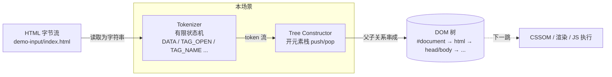
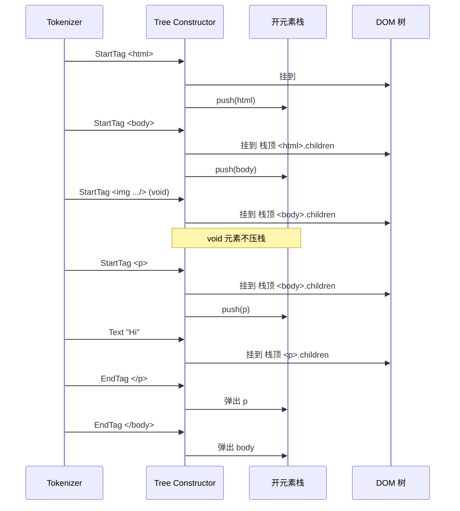

# 5-parse-html-build-dom-tree

## 目标

模拟浏览器拿到 HTML 字节流之后的**第一跳解析工作**：

> 把一段 HTML 字符串变成一棵 DOM 对象树。

这一跳聚焦在**解析层**：字符流如何按有限状态机切成 token，
token 流又如何借助「开元素栈」串成一棵带父子关系的 DOM 树。

---

## 在线性链路中的位置

```
源码
 └─ [0] 读取源码 / 分析依赖
 └─ [1] 编译框架语法为 JS
 └─ [2] 处理 CSS / 图片 / 字体资产
 └─ [3] 产物通过服务器交付
 └─ [4] 浏览器发起请求，收到字节流
 └─ [5] 浏览器解析 HTML，生成 DOM 树     ← 本场景
 └─ [6] (后续) 解析 CSS / 执行 JS / 布局 / 绘制
```

- **输入**：一段 HTML 文本（`demo-input/index.html`）
- **输出**：一棵 DOM 树（Document / Element / Text / Comment 节点）
- **不负责**：CSS 解析、脚本执行、样式计算、布局、绘制

---

## 目录结构

```
5-parse-html-build-dom-tree/
├── README.md
├── 场景图解.md                  # 核心图解：状态机 + 栈构建 DOM 的动画级说明
├── tokenizer-状态机详解.md      # Tokenizer 单独深挖：15 个状态 / 逐字符示例 / 和 WHATWG 规范对照
├── 为什么先-tokenize-再-build-dom-图解.md  # 解释为什么浏览器按流水线增量解析，而不是等整页完成
├── 词法分析-语法分析-和-html-parser-的关系.md  # 用编译原理视角重新理解本场景的两步
├── package.json
├── mini-html-parser.js          # 手写最小实现：tokenizer(状态机) + tree constructor(栈)
├── compare-with-parse5.js       # 与主流方案 parse5 并排对比
├── debug/
│   └── step-by-step.js          # 逐 token 打印"动作/栈前后变化"，可 --inspect-brk 调试
└── demo-input/
    └── index.html               # 最小 HTML 输入样例（含文本/属性/void/注释/嵌套）
```

---

## Mermaid 图



下面是「栈构建 DOM」这一步的核心机制：



更详细的状态机图、栈演化动画、void 元素、错乱 HTML 的处理差异，
请看同目录下的 `场景图解.md`。

---

## 手写最小实现做了什么

`mini-html-parser.js` 把 HTML → DOM 拆成两步：

### ① Tokenizer（`tokenize(input)`）

- 一个有限状态机循环读字符
- 实现的状态：`DATA / TAG_OPEN / TAG_NAME / BEFORE_ATTR_NAME / ATTR_NAME / ATTR_VALUE_(DQ|SQ|UNQ) / SELF_CLOSING / COMMENT / DOCTYPE`
- 产出 5 种 token：`Doctype / StartTag / EndTag / Text / Comment`

### ② Tree Constructor（`buildDomTree(tokens)`）

- 维护一个「开元素栈」，栈底是 `#document`，栈顶永远是「当前插入点」
- `StartTag` → 创建 Element，挂成栈顶的子节点，不是 void 就压栈
- `EndTag` → 从栈顶往下找同名元素，出栈
- `Text / Comment / Doctype` → 直接挂到当前栈顶

### ③ 输出

- 打印 token 列表（52 条）
- 打印 DOM 树（文本/注释/void 元素都能正确显示）
- 打印节点统计

> 想深挖 Tokenizer 的每一个状态转移、逐字符动作、和 WHATWG 规范的对应关系，
> 请看同目录的 [`tokenizer-状态机详解.md`](./tokenizer-状态机详解.md)。
>
> 想理解为什么浏览器要先 tokenize、再增量 build DOM，以及“流式处理”到底提前了什么，
> 请看 [`为什么先-tokenize-再-build-dom-图解.md`](./为什么先-tokenize-再-build-dom-图解.md)。
>
> 想把当前这套 HTML parser 和编译原理里的“词法分析 / 语法分析”对应起来，
> 请看 [`词法分析-语法分析-和-html-parser-的关系.md`](./词法分析-语法分析-和-html-parser-的关系.md)。

---

## 可 debug 的真实场景模拟

`debug/step-by-step.js` 把"Tree Construction 算法"做成慢放动画。
每消费 1 个 token，都打印：

```
─────────────────────────────────────────────────────────────
  Step  20 │ Token: StartTag <h1>
─────────────────────────────────────────────────────────────
  动作     : append <h1> 并压栈
  栈 (之前): #document > html > body > main
  栈 (之后): #document > html > body > main > h1
```

两种调试入口：

```bash
# 1) 命令行逐步阅读
pnpm debug

# 2) 断点调试：在 Chrome DevTools / VSCode 里单步
pnpm debug:inspect
# 然后浏览器访问 chrome://inspect 点 inspect
# 代码里预埋了 debugger; 语句，可实时看 stack / document / t 的变化
```

---

## 手写方案 vs 实际流行方案

| 对比项 | 手写 mini-html-parser | 实际流行方案（parse5 / 浏览器内置 Parser） |
|---|---|---|
| 目标 | 把 HTML 解析的主干讲清楚 | 按 WHATWG HTML 规范健壮地解析任何 HTML |
| 输入 | 人工收敛过的良构 HTML | 互联网上任意"野生" HTML（可能非法/残缺/互相嵌套） |
| 核心动作 | 状态机切词 + 栈构建树 | 同样是状态机 + 栈，规模大得多 |
| 省略内容 | Insertion modes、错误恢复、Foster parenting、命名空间、Raw text、实体解码、源码位置… | 全部补齐 |
| 输出 | 简化 DOM 树（节点类型够用即可） | 规范 DOM（每个节点含 location、namespaceURI、parsing flags…） |
| 价值 | 便于学习、debug、逐行解释 | 稳定、健壮、贴合真实浏览器行为 |

对应四句：

1. **手写方案复现了哪个最核心动作？**
   字符流 → token 流 → DOM 树；状态机 + 开元素栈。
2. **它为了讲清原理故意省掉了哪些能力？**
   Insertion modes、adoption agency 错误恢复、Foster parenting、Raw text（script/style/textarea）、HTML 实体解码、SVG/MathML 命名空间切换、节点源码位置信息。
3. **真实流行方案在工程上补了哪些能力？**
   上面那一整行，全部补齐；`parse5` 直接按 WHATWG HTML 最新版本实现，所有异常 HTML 都能解析出和浏览器一样的树。
4. **边界分别适合什么场景？**
   手写版适合教学、讲解、debug；`parse5`（以及浏览器内置 parser）适合在真实工程里处理真实 HTML。

一句话记忆：

> 手写方案回答"本质上发生了什么"；
> parse5 回答"真实项目里还要补哪些东西才能稳"。

---

## 怎么运行

先装依赖（只需要 parse5）：

```bash
pnpm install
```

三条核心命令：

```bash
# 手写最小实现：打印 token 流 + DOM 树 + 节点统计
pnpm mini

# 与主流方案 parse5 并排对比：两棵树 + 节点数 + 差异说明
pnpm compare

# 可 debug 的逐步模拟：每个 token 消费前后的栈变化
pnpm debug

# 断点调试：在 Chrome DevTools / VSCode 里单步
pnpm debug:inspect
```

也可以换成其他 HTML 输入：

```bash
node mini-html-parser.js path/to/other.html
node compare-with-parse5.js path/to/other.html
node debug/step-by-step.js path/to/other.html
```

---

## 这个场景能回答的四个问题

1. **这一跳为什么存在？**
   字节流不能直接参与样式/布局/JS，必须先变成结构化对象——DOM 树。
2. **它的输入是什么？**
   已经解码的 HTML 字符串。
3. **它的输出是什么？**
   一棵 Document → Element → Text/Comment 的节点树。
4. **它和前后两跳的边界是什么？**
   上游：字节流（场景 4）；下游：CSSOM 构建、JS 执行、布局、绘制（后续场景）。

---

## 一句结论

HTML 解析的本质就两件事：

```
有限状态机 → 切词
一个栈    → 串树
```

手写版把这两条主干裸露出来；
`parse5` / 真实浏览器在同一条主干上又覆盖了大量异常分支。
调试 `debug/step-by-step.js` 一遍，就能看到栈的每一次 push/pop 如何把字节串变成了一棵树。
