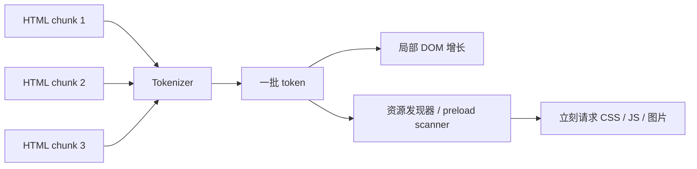
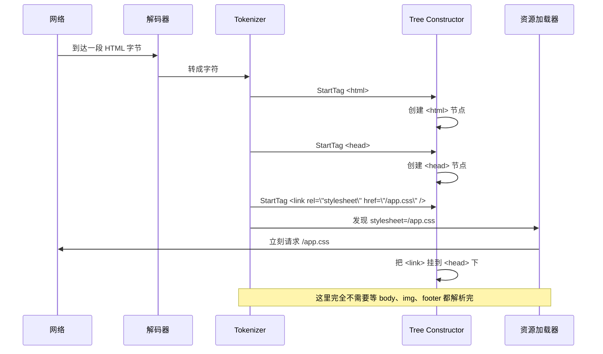
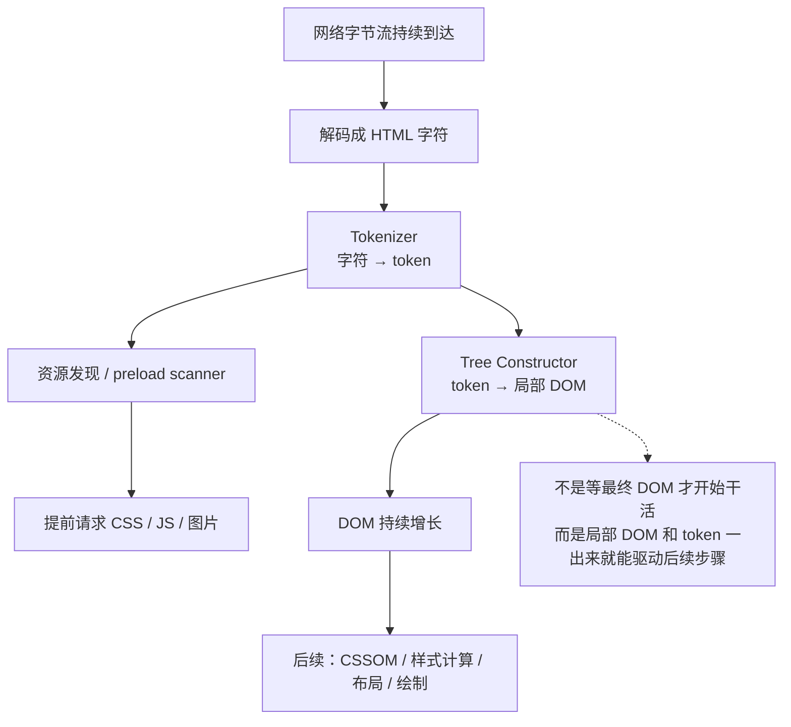

# 为什么先 Tokenize，再 Build DOM · 图解

---

## 一、先说结论

浏览器不是这样工作的：

```text
HTML 全部到齐
  → tokenize 全部做完
  → DOM 树一次性 build 完
  → 再开始请求 CSS / JS / 图片
```

浏览器更接近这样：

```text
HTML 字节一段段到达
  → 解码成字符
  → Tokenizer 先吐出一小批 token
  → Tree Constructor 立刻把这批 token 挂成局部 DOM
  → 同时触发“已经足够确定”的后续工作
  → 再继续处理下一批字符
```

一句话：

> **DOM 树不是最后一次性生成的，而是边读、边切 token、边增量长出来的。**

---

## 二、为什么不能直接“字符流 → DOM 树”

因为这其实是两类完全不同的问题：

| 阶段 | 它解决什么问题 | 输入粒度 | 输出粒度 |
|---|---|---|---|
| Tokenizer | “这一串字符到底是什么” | 字符 | token |
| Tree Constructor | “这个 token 应该挂到树的哪里” | token | DOM 节点树 |

例如这段 HTML：

```html
<button class="primary">Click <span>Me</span></button>
```

Tokenizer 负责回答：

- `<button ...>` 是一个 `StartTag`
- `class="primary"` 是属性
- `Click ` 是一个 `Text`
- `<span>` 是另一个 `StartTag`
- `</span>` / `</button>` 是两个 `EndTag`

Tree Constructor 负责回答：

- `<button>` 要挂到谁下面
- `Click ` 文本要挂到 `<button>` 下面
- `<span>` 要挂到 `<button>` 下面，同时压栈
- `Me` 要挂到 `<span>` 下面
- `</span>` 来了要出栈

所以“字符识别”和“树挂载”最好拆开，否则同一个循环里既要管引号、空白、注释边界，又要管树栈 push/pop，复杂度会混在一起。

---

## 三、核心误区：不是“等整棵树建好”，而是“树在持续增长”

你现在卡住的点，本质上是把 DOM 树想成了：

```text
像 JSON.parse() 一样
输入一整段字符串
最后 return 一棵完整树
```

但浏览器里的 DOM 树更像这样：

```text
#document
  └─ <html>          ← 先长出来
      └─ <head>      ← 再长出来
          └─ <link>  ← 再长出来
      └─ <body>      ← 后面继续长
          └─ <h1>
          └─ 
```

也就是说：

- 不是“最后突然出现一整棵树”
- 而是“前缀 HTML 先变成前缀 DOM”

只要前面这一段已经足够确定，浏览器就能先用这一段做一些事。

---

## 四、用一段真实 HTML 看“边解析边工作”

假设 HTML 是：

```html
<html>
  <head>
    <link rel="stylesheet" href="/app.css" />
  </head>
  <body>
    <h1>Hello</h1>
    
  </body>
</html>
```

### 时间线版本

```text
Step 1  读到 <html>
  token: StartTag <html>
  DOM: #document -> <html>

Step 2  读到 <head>
  token: StartTag <head>
  DOM: #document -> <html> -> <head>

Step 3  读到 <link rel="stylesheet" href="/app.css" />
  token: StartTag <link .../>
  DOM: <link> 挂到 <head> 下
  同时：浏览器已经知道“有个 stylesheet = /app.css”
  所以：立刻发起 /app.css 请求

Step 4  继续读到 <body>
  token: StartTag <body>
  DOM: <body> 挂到 <html> 下

Step 5  读到 <h1>Hello</h1>
  token: <h1> / Text / </h1>
  DOM: <body> 下长出 <h1>Hello</h1>

Step 6  读到 
  token: StartTag 
  DOM:  挂到 <body> 下
  同时：浏览器已经知道“有个图片资源 = /logo.png”
  所以：立刻发起 /logo.png 请求
```

关键点是：

> **请求 `/app.css` 时，`<body>` 甚至都还没解析完。**

这就是“流式处理”的真正收益。

---

## 五、图 1：错误理解 vs 真实流水线

### 错误理解：整页批处理


这条链路的问题是：**所有后续动作都被整页 HTML 阻塞住了**。

### 真实浏览器：增量流水线



这里的重点不是“跳过 DOM”，而是：

> **Tokenizer、局部 DOM 构建、资源发现，这三件事在同一条流水线上重叠发生。**

---

## 六、图 2：为什么 token 比“整棵 DOM”更早可用



这张图回答的是：

**为什么“先有 token”很重要？**

因为 token 一出来，浏览器就已经拿到了足够强的结构化信息：

- 这是 `link`
- `rel=stylesheet`
- `href=/app.css`

这时就已经够触发资源请求了，没必要等整棵 DOM 树最后 build 完。

---

## 七、图 3：局部 DOM 已经是“可用的真树”

读到这里：

```html
<body>
  <main>
    <h1>Hello</h1>
```

浏览器内部已经可以长成：

```text
#document
└─ <html>
   └─ <body>
      └─ <main>
         └─ <h1>
            └─ "Hello"
```

虽然：

- 后面可能还有 `<section>`
- 还有 ``
- 还有 `<script>`

但前面这棵**局部树**已经是真的 DOM，不是临时假数据。

所以浏览器很多工作只需要：

```text
“当前已经构出来的这部分”
```

而不需要：

```text
“最终整页的完整版本”
```

---

## 八、为什么“等整棵树好了再说”会很慢

假设页面头部一开始就有：

```html
<head>
  <link rel="stylesheet" href="/app.css" />
</head>
<body>
  <!-- 后面还有 500KB HTML -->
</body>
```

如果浏览器必须：

1. 等 500KB HTML 全部下载完
2. 再统一 tokenize
3. 再统一 build DOM
4. 然后才看到 `<link>`
5. 然后才请求 `/app.css`

那 CSS 下载会被平白推迟很久。

真实浏览器的策略是：

```text
只要已经足够知道“该请求 /app.css 了”，就立刻发请求
```

这就把：

- HTML 下载
- HTML 解析
- CSS 下载

三件事重叠起来了。

---

## 九、那是不是“完全不需要等 DOM”？

也不是。

更准确的说法是：

> **有些工作只需要 token / 局部 DOM，就能提前做；**
> **有些工作必须等更完整的 DOM，甚至必须暂停解析。**

### 可以提前做的

- 发现 `<link rel="stylesheet">` → 请求 CSS
- 发现 `` → 请求图片
- 发现 `<script src>` → 预备请求脚本
- 局部 DOM 足够了 → 可以推进首屏相关的后续步骤

### 不能完全提前做的

- 最终完整 DOM 的收尾
- 依赖后续节点的某些布局/绘制工作
- 依赖文档后面结构的脚本逻辑

### 甚至会“卡住解析”的

```html
<script src="/main.js"></script>
```

同步脚本经常会要求：

1. 暂停 HTML 解析
2. 先下载并执行脚本
3. 再继续往后解析

因为脚本可能会改当前 DOM，甚至 `document.write()` 新内容。

所以正确理解不是：

```text
浏览器完全并行，一点都不用等
```

而是：

```text
浏览器在保证语义正确的前提下，能提前的尽量提前
```

---

## 十、为什么“先 tokenize 再 build DOM”是天然分层

如果不分层，你在同一个循环里要同时处理两套问题：

### 问题 A：字符级问题

- 当前字符是不是 `<`
- 现在是在标签名里，还是属性值里
- 引号闭了没有
- `<!--` 是不是注释开始

### 问题 B：树结构问题

- 当前插入点是谁
- `<span>` 应该挂到哪个节点下面
- `</p>` 应该把谁出栈
- `img` 是 void 元素，不该压栈

把两类问题拆开后：

```text
字符流  ──► Tokenizer ──► token 流 ──► Tree Constructor ──► DOM 树
```

得到三个巨大好处：

1. **复杂度分层**：字符问题和树问题不混在一起
2. **可以流式推进**：token 一出来就能被下游消费
3. **更容易 debug**：切词错了看 Tokenizer；树挂错了看 Tree Constructor

---

## 十一、把它类比成工厂流水线

你可以把 HTML 解析想成一个工厂：

### 方案 A：全部原料堆满再统一加工

```text
原料全部进仓
  → 统一分拣
  → 统一组装
  → 最后统一发货
```

问题：前面的等待时间太长，后面的工位都在空转。

### 方案 B：流水线式分工

```text
原料一到
  → 分拣工位先认出来
  → 组装工位立刻拿走上一批
  → 配送工位看到订单就先发货
```

浏览器就是方案 B。

- Tokenizer = 分拣工位
- Tree Constructor = 组装工位
- Resource Loader = 配送工位

它们不是前一个全做完、后一个才开始，而是**流水线重叠工作**。

---

## 十二、一张总图记住它



---

## 十三、一句话总结

> 浏览器先 tokenize，再增量 build DOM，不是因为“必须绕一层”，
> 而是因为这样可以把“字符识别”和“树构建”拆开，
> 同时让 **局部 token、局部 DOM、资源请求** 三件事形成流水线重叠执行。

所以不是：

```text
必须先等整棵树 build 好，后面才开始
```

而是：

```text
树本身就是边解析边增长的；
很多后续工作只需要 token 或局部 DOM，就已经可以先启动。
```
