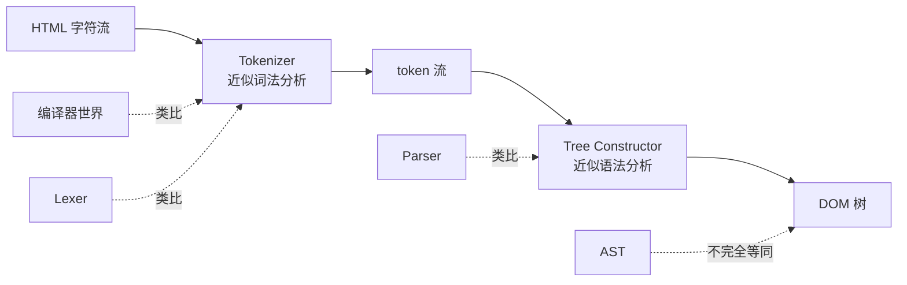

# 词法分析、语法分析，和 HTML Parser 的关系

---

## 一、先给结论

如果借用编译原理的术语，这个场景里的两步大致可以这样对应：

```text
HTML 字符流
  └─ Tokenizer         ≈ 词法分析（Lexical Analysis）
       把字符切成 token

token 流
  └─ Tree Constructor  ≈ 语法分析（Syntax Analysis / Parsing）
       把 token 组织成树
```

所以最粗粒度的理解是：

- `tokenize(input)` 对应 **词法分析**
- `buildDomTree(tokens)` 对应 **语法分析**

但要立刻补一句：

> **HTML 解析和经典编译器里的“词法分析 + 语法分析”很像，但不完全一样。**

因为浏览器里的 HTML Parser 比普通编译器 parser 更“脏活累活”：

- 需要处理不规范的输入
- 需要错误恢复
- 需要边解析边建树
- 需要和资源加载、脚本执行配合

所以它不是一个“只看 CFG 文法、严进严出”的传统 parser。

---

## 二、先回忆编译原理里的标准分层

在经典编译器里，通常会这样分层：

```text
源代码字符串
  → 词法分析（Lexer / Tokenizer）
  → token 流
  → 语法分析（Parser）
  → AST
  → 后续语义分析 / 优化 / 代码生成
```

例如：

```js
const x = 1 + 2;
```

### 词法分析做什么

把字符切成 token：

```text
const      → Keyword
x          → Identifier
=          → Operator
1          → Number
+          → Operator
2          → Number
;          → Punctuation
```

### 语法分析做什么

把 token 按语言规则组织成树：

```text
VariableDeclaration
├─ kind: const
├─ id: Identifier(x)
└─ init: BinaryExpression(+)
   ├─ Literal(1)
   └─ Literal(2)
```

这个套路你应该已经很熟：

> **词法分析解决“字符属于什么 token”**
>
> **语法分析解决“这些 token 组合起来表示什么结构”**

HTML parser 的主干和它就是同一个套路。

---

## 三、映射到当前场景

当前场景的代码是：

```text
HTML 字符串
  → tokenize(input)
  → tokens[]
  → buildDomTree(tokens)
  → DOM 树
```

### 第一步：`tokenize(input)` 为什么像词法分析

因为它处理的是**字符级问题**：

- 当前字符是不是 `<`
- 现在是在正文里，还是在标签名里
- 是属性名，还是属性值
- `<!--` 是不是注释开始
- `<!doctype` 是不是文档类型声明

它产出的也是典型 token：

```js
{ type: 'StartTag', tagName: 'p', attrs: [] }
{ type: 'Text', value: 'Hello ' }
{ type: 'StartTag', tagName: 'em', attrs: [] }
{ type: 'Text', value: 'DOM' }
{ type: 'EndTag', tagName: 'em', attrs: [] }
{ type: 'EndTag', tagName: 'p', attrs: [] }
```

这和普通 lexer 的精神完全一致：

> **把原始字符流切成“更有结构的最小单元”。**

---

## 四、`buildDomTree(tokens)` 为什么像语法分析

因为它已经不再关心字符细节，而是在处理**结构级问题**：

- `<p>` 该挂到谁下面
- `<em>` 是 `<p>` 的子节点
- `Text("DOM")` 应该挂到当前栈顶 `<em>` 下面
- `</em>` 来了要把 `<em>` 出栈
- `</p>` 来了要把 `<p>` 出栈

也就是：

> 它不再回答“这几个字符是什么”，
> 而是在回答“这些 token 组成了什么树结构”。

这正是语法分析的核心职责。

你可以把：

```html
<p>Hello <em>DOM</em></p>
```

看成：

### 词法分析输出

```text
StartTag <p>
Text "Hello "
StartTag <em>
Text "DOM"
EndTag </em>
EndTag </p>
```

### 语法分析输出

```text
<p>
  "Hello "
  <em>
    "DOM"
  </em>
</p>
```

只是这里产出的不是编译器常见的 AST，而是浏览器直接要用的 **DOM 树**。

---

## 五、DOM 树和 AST 的关系

这里很容易混淆，最好单独说清楚。

### 编译器里

通常是：

```text
token 流 → AST
```

AST（抽象语法树）强调的是：

- 方便做语义分析
- 方便做变换和代码生成
- 不一定保留源码里的所有表面细节

例如 JS AST 里一般不会把每个空白字符都留成节点。

### 浏览器 HTML 里

通常是：

```text
token 流 → DOM 树
```

DOM 树强调的是：

- 给浏览器后续样式计算 / 布局 / 渲染 / JS 操作使用
- 更接近“运行时对象树”
- 注释、文本、属性、节点顺序都很重要

所以：

> **DOM 不是 AST 的简单同义词。**

可以粗暴类比成“HTML 解析后的树”，但它的用途和编译器 AST 不一样。

一个很实用的理解是：

| 结构 | 主要用途 |
|---|---|
| AST | 给编译器做分析、变换、生成代码 |
| DOM | 给浏览器运行时读、改、算样式、布局、渲染 |

---

## 六、为什么说 HTML 的“语法分析”不完全像经典 Parser

这部分最关键。

如果是传统编译器，语法分析往往基于比较明确的文法：

```text
Expression -> Term ('+' Term)*
Term       -> Factor ('*' Factor)*
```

如果输入不合法，parser 很可能直接报错停止。

但 HTML 不是这样。

浏览器面对的是互联网上真实网页，它们经常：

- 标签没闭合
- 嵌套顺序错乱
- 漏了 `<html>` / `<head>` / `<body>`
- `<table>` 里面塞进奇怪的东西
- 属性写得不规范

浏览器不能说：

```text
Parse Error. Stop.
```

它必须尽量恢复，继续产出一棵“还能用”的 DOM 树。

所以 HTML 的第二步虽然可以类比成“语法分析”，但它更准确的名字其实是：

> **Tree Construction（树构建）**

而不是传统编译器意义上的“纯 Parser”。

因为它除了“按规则识别结构”之外，还承担了：

- 自动补齐缺失节点
- 错误恢复
- 调整节点挂载位置
- 根据上下文切换插入模式（in head / in body / in table ...）

这已经比普通 CFG parser 更“工程化”了。

---

## 七、图 1：把三者放在一张图里



这张图最想表达的只有两点：

1. `Tokenizer ≈ Lexer`
2. `Tree Constructor ≈ Parser`

但：

3. `DOM ≠ AST`，只是都属于“树形结果”

---

## 八、图 2：同一个例子在两套术语里的对应

输入：

```html
<p>Hello <em>DOM</em></p>
```

### 用 HTML parser 的术语说

```text
字符流
  → Tokenizer
  → StartTag/Text/StartTag/Text/EndTag/EndTag
  → Tree Constructor
  → DOM 树
```

### 用编译原理的术语说

```text
源代码字符流
  → 词法分析
  → token 流
  → 语法分析
  → 树形结构
```

其实是在说同一件事，只是：

- 浏览器文档里更常说 `Tokenizer` / `Tree Constructor`
- 编译原理教材里更常说 `Lexer` / `Parser`

---

## 九、为什么浏览器不直接说“词法分析 / 语法分析”

因为 HTML 解析的细节和普通编程语言差异太大。

浏览器规范更偏向用**具体行为名**来描述它到底在做什么：

- `Tokenization`
- `Tree construction`
- `Insertion mode`
- `Adoption agency algorithm`
- `Foster parenting`

这些名字都比“Parser”更精确。

因为如果只说：

```text
这是个 parser
```

你会自然联想到：

- LL / LR / Pratt
- 明确的上下文无关文法
- 语法错了就报错退出

但 HTML parser 不是那种世界观。

它是：

- 面向脏输入
- 面向错误恢复
- 面向浏览器运行时
- 面向流式处理

所以规范更愿意写得具体一点，而不是直接套经典编译器术语。

---

## 十、可以这样记忆三层关系

### 第一层：编译原理版

```text
字符流 → 词法分析 → token 流 → 语法分析 → 语法树
```

### 第二层：HTML parser 版

```text
HTML 字符流 → Tokenizer → token 流 → Tree Constructor → DOM 树
```

### 第三层：场景 5 代码版

```text
input string → tokenize(input) → tokens[] → buildDomTree(tokens) → document
```

所以三层是一一映射的，只是命名不同、结果结构不同、错误恢复能力也不同。

---

## 十一、再进一步：为什么 tokenizer / parser 分层这么重要

如果把它们糊成一步，你会在同一个循环里同时处理：

- 当前字符是不是 `<`
- 当前是不是在双引号属性值里
- 当前标签该挂到谁下面
- `</p>` 该弹谁出栈
- `img` 是不是 void element

这会把：

- 字符级状态
- 结构级状态
- 错误恢复逻辑

全部搅在一起。

分层之后：

### Tokenizer 层

只关心：

- 把字符切准
- 产出稳定 token

### Tree Constructor 层

只关心：

- 用 token 构树
- 维护开元素栈
- 做结构级纠错

这也是为什么编译器和浏览器都倾向于分成两层。

---

## 十二、一个特别容易误解的点

有人会说：

> “既然 Tree Constructor 已经是在做语法分析，那 Tokenizer 是不是可有可无？”

不是。

因为 Tree Constructor 处理的是：

```text
StartTag / EndTag / Text / Comment / Doctype
```

而不是原始字符：

```text
< p   c l a s s = " x " >
```

如果没有 Tokenizer，Tree Constructor 就得自己处理：

- 标签边界
- 引号
- 属性名值切分
- 注释结束符
- doctype

那它就失去“只处理结构”的纯度了。

所以：

> **词法分析不是可选预处理，而是把字符世界转换成结构世界的分界线。**

---

## 十三、一句话总结

> 在当前这个 HTML parser 场景里：
>
> - `Tokenizer` 可以理解成 **词法分析**
> - `Tree Constructor` 可以理解成 **语法分析**
> - `DOM 树` 可以理解成“解析后的树形结果”，但它**不等于**编译器里的 AST
>
> 同时要记住：HTML 的“语法分析”比传统编译器 parser 更复杂，因为它还承担了错误恢复、自动补齐、插入模式切换和流式构建等职责。

---

## 十四、和当前场景其他文档怎么配合看

建议按这个顺序：

1. `README.md`
   先看整个场景在前端链路里的位置
2. `为什么先-tokenize-再-build-dom-图解.md`
   先建立“为什么要分两步、为什么能流式”的整体感知
3. `tokenizer-状态机详解.md`
   深挖“词法分析”这一层到底怎么逐字符切 token
4. `场景图解.md`
   再看 token 如何借助开元素栈变成 DOM
5. 本文
   把上面几份材料用“词法分析 / 语法分析”的理论框架重新串起来

这样你会同时拥有两套视角：

- **工程视角**：Tokenizer / Tree Constructor / DOM
- **理论视角**：词法分析 / 语法分析 / 树形结果

两套视角对上之后，这一跳就会非常清楚。
