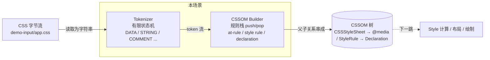

# 6-parse-css-build-cssom-tree

## 目标

模拟浏览器拿到 CSS 文本之后的**解析一跳**：

> 把一段 CSS 字符串变成一棵 CSSOM 对象树。

这一跳聚焦在**解析层**：字符流如何按状态机切成 CSS token，
token 流又如何按"at-rule / qualified rule / declaration"的语法规则串成
一棵 `CSSStyleSheet → CSSRule → Declaration` 的对象树。

它和场景 5 是**同构的一跳**，只是主角从 HTML 换成了 CSS，
从"开元素栈构建 DOM"换成了"规则栈构建 CSSOM"。

---

## 在线性链路中的位置

```
源码
 └─ [0] 读取源码 / 分析依赖
 └─ [1] 编译框架语法为 JS
 └─ [2] 处理 CSS / 图片 / 字体资产
 └─ [3] 产物通过服务器交付
 └─ [4] 浏览器发起请求，收到字节流
 └─ [5] 浏览器解析 HTML，生成 DOM 树
 └─ [6] 浏览器解析 CSS，生成 CSSOM 树     ← 本场景
 └─ [7] (后续) Style 计算 / 布局 / 绘制 / 合成 / JS 执行
```

- **输入**：一段 CSS 文本（`demo-input/app.css`）
- **输出**：一棵 CSSOM 树（`CSSStyleSheet / CSSStyleRule / CSSImportRule / CSSMediaRule / Declaration`）
- **不负责**：把 CSSOM 和 DOM 合起来做样式匹配（Style 计算）、布局、绘制、JS 执行

> DOM 树 + CSSOM 树是下一跳"Render Tree / Style Computed Tree"的两个输入；
> 本场景只管把 CSS 这一侧的树建出来。

---

## 目录结构

```
6-parse-css-build-cssom-tree/
├── README.md
├── 场景图解.md                  # 核心图解：状态机 + 规则栈构建 CSSOM 的动画级说明
├── package.json
├── mini-css-parser.js           # 手写最小实现：tokenizer(状态机) + CSSOM builder(规则栈)
├── compare-with-postcss.js      # 与主流方案 postcss 并排对比
├── debug/
│   └── step-by-step.js          # 逐 token 打印 [动作 / 上下文 / 规则栈]，可 --inspect-brk 调试
└── demo-input/
    └── app.css                  # 最小 CSS 输入样例（含 @import/@media/自定义属性/!important/函数值）
```

---

## Mermaid 图



下面是「规则栈构建 CSSOM」这一步的核心机制：

```mermaid
sequenceDiagram
    participant TK as Tokenizer
    participant PS as Parser
    participant ST as 规则栈
    participant CSSOM as CSSOM

    TK->>PS: atKeyword @import
    PS->>CSSOM: 追加 ImportRule 到 CSSStyleSheet
    Note over PS,ST: statement at-rule，不压栈

    TK->>PS: ident body
    PS->>PS: 开始收集 selector (IN_PRELUDE)

    TK->>PS: '{'
    PS->>CSSOM: 创建 StyleRule(body)，挂到栈顶
    PS->>ST: push(StyleRule body)
    Note over PS: ctx 切到 IN_DECL_BLOCK

    TK->>PS: ident margin → ':' → number 0 → ';'
    PS->>CSSOM: 栈顶的 declarations.push({margin:0})

    TK->>PS: '}'
    PS->>ST: 弹出 StyleRule(body)

    TK->>PS: atKeyword @media → prelude → '{'
    PS->>CSSOM: 创建 MediaRule
    PS->>ST: push(MediaRule)
    Note over PS: 进入嵌套，下面的规则挂到 MediaRule.rules
```

更详细的状态机图、规则栈演化动画、@media 嵌套、`!important` 提取，
请看同目录下的 `场景图解.md`。

---

## 手写最小实现做了什么

`mini-css-parser.js` 把 CSS → CSSOM 拆成两步：

### ① Tokenizer（`tokenize(input)`）

- 一个有限状态机循环读字符
- 实现的状态：`DATA / STRING_DQ / STRING_SQ / COMMENT`
- 产出的 token 类型：
  - `ident`（`body` / `margin` / `sans-serif`）
  - `atKeyword`（`@import` / `@media`）
  - `hash`（`#fff` / `#root`）
  - `number`（带可选单位：`24px` / `1.25` / `100%`）
  - `string`（`"reset.css"`）
  - `function`（`url(` / `var(`）
  - 标点：`{ } ( ) [ ] , ; :`
  - `delim`：其他单字符（`> + ~ * . !` 等）
  - 以及 `ws / comment`（后续解析时会被过滤掉，但位置信息保留）

### ② CSSOM Builder（`buildCssom(input, tokens)`）

- 维护一个「规则栈」，栈底是 `CSSStyleSheet`，栈顶是"当前正在写入的容器"
- 根据当前 context 决定下一步怎么读：
  - `TOP_LEVEL / IN_MEDIA_BODY` → 期待下一个规则的开头
  - `IN_PRELUDE` → 正在收集 selector 或 at-rule 前导；遇到 `;` 或 `{` 结束
  - `IN_DECL_BLOCK` → 正在读 `property : value ;` 序列；遇到 `}` 出栈
- 关键动作：
  - `@import "..."` / `@charset "..."` → **statement at-rule**，一句话完，不压栈
  - `@media (...) { ... }` → **block at-rule**，创建 `MediaRule`，压栈，里面再递归挂 `StyleRule`
  - 普通 `selector { ... }` → 创建 `StyleRule`，压栈，进入声明块
  - 声明块里每个 `property: value [!important];` → 追加到栈顶的 `declarations` 数组

### ③ 输出

- 打印有效 token 列表
- 打印 CSSOM 树（`CSSStyleSheet → @import / StyleRule / @media(StyleRule) → Declaration`）
- 打印规则 / 声明数量统计

---

## 可 debug 的真实场景模拟

`debug/step-by-step.js` 把 CSSOM 构建过程做成慢放动画。
每消费 1 个有效 token，都打印：

```
─────────────────────────────────────────────────────────────
  Step  38 │ Token: punct       {
─────────────────────────────────────────────────────────────
  动作       : 遇到 '{'，开始解析 "body" 的声明块，进入 IN_DECL_BLOCK
  context    : IN_PRELUDE  →  IN_DECL_BLOCK
  栈 (之前)  : (top-level)
  栈 (之后)  : body { …
```

两种调试入口：

```bash
# 1) 命令行逐步阅读
pnpm debug

# 2) 断点调试：在 Chrome DevTools / VSCode 里单步
pnpm debug:inspect
# 然后浏览器访问 chrome://inspect 点 inspect
# 代码里预埋了 debugger; 语句，可实时看 stack / currentRule / currentDecl / ctx 的变化
```

---

## 手写方案 vs 实际流行方案

| 对比项 | 手写 mini-css-parser | 实际流行方案（postcss / 浏览器内置 CSS Parser） |
|---|---|---|
| 目标 | 把 CSS 解析的主干讲清楚 | 按 CSS Syntax L3 + 浏览器行为健壮解析任何 CSS |
| 输入 | 人工收敛过的良构 CSS | 互联网上任意 CSS（可能非法 / 嵌套 / 带各种 vendor prefix） |
| 核心动作 | 状态机切词 + 规则栈串树 | 同样是状态机 + 递归下降/规则栈，规模大得多 |
| 省略内容 | 位置信息、raws（原始空白）、转义、Unicode、CDO/CDC、错误恢复、选择器 AST、value AST、插件管线 | 全部补齐 |
| 输出 | 简化 CSSOM（够用的 rule / declaration 模型） | 规范 AST（每节点含 source.start/end、raws、parent 链接、可反向 stringify） |
| 价值 | 便于学习、debug、逐行解释 | 稳定、健壮、支持增量变换 / source map / 工程插件链路 |

对应四句：

1. **手写方案复现了哪个最核心动作？**
   字符流 → token 流 → CSSOM 树；状态机 + 规则栈。
2. **它为了讲清原理故意省掉了哪些能力？**
   位置信息 / source map / raws（保格式）/ 插件管线 / 错误恢复 / 字符转义 / 选择器内部 AST / value 内部 AST。
3. **真实流行方案在工程上补了哪些能力？**
   上面那一整行，全部补齐；`postcss` 做成"AST 总线"，tailwind / autoprefixer / cssnano 都挂在它上面；浏览器内置 parser 还要把 CSSOM 接进 style engine 做样式匹配。
4. **边界分别适合什么场景？**
   手写版适合教学、讲解、debug；`postcss`（以及浏览器内置 CSS parser）适合在真实工程里处理真实 CSS。

一句话记忆：

> 手写方案回答"本质上发生了什么"；
> postcss 回答"真实工程里还要补哪些东西才能稳地参与构建和变换"。

---

## 怎么运行

先装依赖（只需要 postcss）：

```bash
pnpm install
```

四条核心命令：

```bash
# 手写最小实现：打印 token 流 + CSSOM 树 + 统计
pnpm mini

# 与主流方案 postcss 并排对比：两棵树 + 数量 + 差异说明
pnpm compare

# 可 debug 的逐步模拟：每个 token 消费前后的规则栈 / 上下文变化
pnpm debug

# 断点调试：在 Chrome DevTools / VSCode 里单步
pnpm debug:inspect
```

也可以换成其他 CSS 输入：

```bash
node mini-css-parser.js path/to/other.css
node compare-with-postcss.js path/to/other.css
node debug/step-by-step.js path/to/other.css
```

---

## 这个场景能回答的四个问题

1. **这一跳为什么存在？**
   CSS 文本不能直接参与样式匹配 / 布局 / 绘制，必须先变成结构化对象——CSSOM 树。
2. **它的输入是什么？**
   已经解码的 CSS 字符串（一般来自 `<style>` 内容或 `.css` 文件）。
3. **它的输出是什么？**
   一棵 `CSSStyleSheet → CSSRule (StyleRule / ImportRule / MediaRule) → Declaration` 的对象树。
4. **它和前后两跳的边界是什么？**
   上游：HTML 解析得到的 DOM 树以及 `<link>/<style>` 对应的 CSS 文本（场景 5 / 场景 4）；
   下游：把 CSSOM 叠到 DOM 上做样式匹配 / 样式计算（Render Tree，下一场景）。

---

## 一句结论

CSS 解析的本质也就两件事：

```
有限状态机 → 切词
一个规则栈 → 串树
```

手写版把这两条主干裸露出来；
`postcss` / 真实浏览器在同一条主干上又覆盖了位置信息、保格式、错误恢复、插件管线。
调试 `debug/step-by-step.js` 一遍，就能看到规则栈是如何从空开始，
一步步把字符流串成一棵 `CSSStyleSheet` 的。
